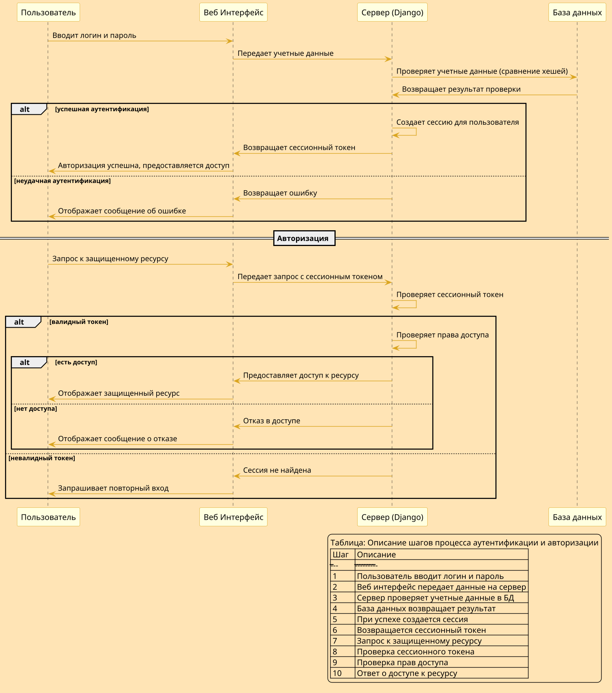
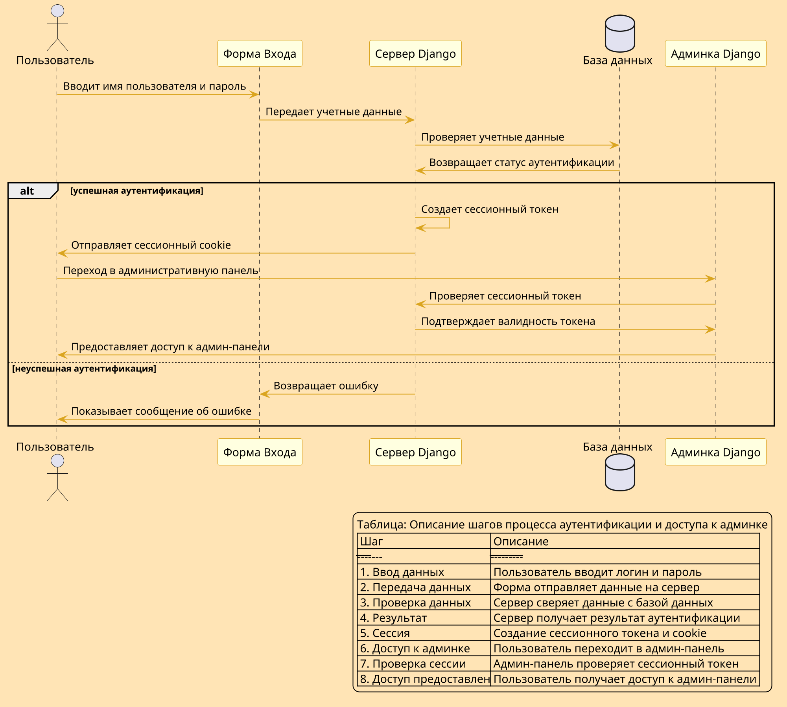

# Пользователи в Django

## Пользователи. Аутентификация и Авторизация

**Аутентификация** – это процесс установления и подтверждения идентичности пользователя в системе. В контексте веб-приложений это обычно означает проверку того, что пользователь действительно тем, за кого он себя выдает. Для этого пользователь предоставляет учетные данные, такие как имя пользователя и пароль, которые система сверяет с сохраненными данными. Если данные совпадают, система признает пользователя.

**Авторизация** – это процесс предоставления пользователю доступа к определенным ресурсам или функциям после успешной аутентификации. Это означает определение того, что разрешено делать пользователю в системе, например, какие страницы он может просматривать, какие данные может редактировать или к каким файлам имеет доступ.

**Роль аутентификации и авторизации в Django:**
1. **Безопасность**: Аутентификация помогает обеспечить, что доступ к системе имеют только пользователи с действующими учетными данными. Авторизация позволяет удостовериться, что каждый пользователь может взаимодействовать только с теми частями системы, к которым у него есть права доступа.

2. **Контроль доступа**: Они позволяют разграничивать права доступа между различными пользователями и группами пользователей. Например, обычные пользователи могут иметь доступ только к чтению информации, в то время как администраторы могут редактировать и удалять данные.

3. **Персонализация**: Аутентификация позволяет системе предоставлять персонализированный опыт для пользователя, например, показывать его персональные настройки или сохраненные данные.

**Почему это важно изучать в контексте Django?**
Django предоставляет встроенные средства для аутентификации и авторизации, которые можно легко настроить и интегрировать в ваши приложения. Это не только экономит время разработки, но и повышает безопасность приложения, так как вам не приходится писать сложный код для обработки учетных данных и прав доступа с нуля. Знание этих механизмов позволяет создавать многопользовательские веб-приложения, где каждый пользователь может безопасно взаимодействовать с системой согласно своим правам.

https://docs.djangoproject.com/en/4.2/topics/auth/default/

## Пользователи. Как реализуется авторизация пользователя?

Механизм авторизации пользователя, сессии, проверка статуса аутентификации пользователя, хранение и обработка паролей — все это ключевые аспекты безопасности веб-приложений. Давайте подробно рассмотрим каждый из этих пунктов.

### Как реализуется механизм авторизации пользователя?

Авторизация пользователя начинается после успешной аутентификации. После того как система удостоверилась в подлинности пользователя, она должна определить, к каким ресурсам и операциям у пользователя есть доступ. Это обычно реализуется через систему разграничения прав доступа, которая может включать:

- **Роли пользователей**: Пользователи могут быть членами разных групп, каждая из которых имеет определенные права доступа к ресурсам и операциям.
- **Правила и политики**: Определяют, какие действия разрешены для конкретных объектов данных или функций системы.
- **Проверки на уровне кода**: При попытке пользователя выполнить определенное действие система проверяет, имеет ли он на это право.

### Что такое сессии?

Сессия — это способ сохранения данных о пользователе с одного запроса к серверу к другому. Это временное хранилище информации, которое сервер использует для идентификации пользователя в рамках серии запросов. Сессии обычно реализуются с помощью cookies или сессионных идентификаторов, которые сохраняются в браузере пользователя и отправляются с каждым запросом к серверу.

### Как проверяется, авторизовался пользователь или нет?

Проверка аутентификации пользователя обычно происходит через проверку наличия валидной сессии или соответствующего токена аутентификации, которые создаются после успешного входа в систему. Если такой информации нет или она не действительна, система считает пользователя неавторизованным.

### Хранение и обработка паролей в Django

В Django пароли пользователей хранятся в таблице `auth_user`, но не в исходном виде. Вместо этого используется процесс, называемый хешированием. 

- **Хеширование паролей**: Это односторонний процесс преобразования исходного пароля в набор символов фиксированной длины. Django использует соль (случайная строка, добавляемая к паролю перед хешированием) и алгоритм хеширования (например, bcrypt) для создания хеша пароля. Это делается для усиления безопасности: даже если два пользователя используют одинаковые пароли, их хеши будут различаться из-за разной соли.
  
- **Проверка пароля**: При попытке входа в систему введенный пароль сначала смешивается с той же солью, что использовалась при первоначальном хешировании, а затем хешируется тем же алгоритмом. Полученный хеш сравнивается с хешем, хранящимся в базе данных. Если они совпадают, пароль считается верным.

### Секретный ключ в Django

Секретный ключ Django используется для дополнительной защиты данных и подписи сессий. Этот ключ должен быть уникальным для каждого проекта и храниться в безопасности, так как его использование включает в себя криптографическую подпись, которая может помочь защитить или проверить данные, сохраненные в cookies или сессиях.

Таким образом, аутентификация и авторизация в Django обеспечиваются множеством встроенных механизмов и методов, которые помогают разработчикам создавать безопасные веб-приложения, управляя доступом к ресурсам и операциям в приложении.

Вот PlantUML диаграмма последовательности, которая иллюстрирует процесс аутентификации и авторизации пользователя в веб-приложении, например, используя Django:



Эта диаграмма последовательности визуализирует процесс аутентификации пользователя через веб-интерфейс и сервер, используя базу данных для проверки учетных данных, а затем управляет сессией для авторизации запросов к ресурсам.


Подробная, понятная инструкция, с примерами кода (в коде можно делать в важных участках комментарии на русском языке #) и после с поясненями, чтобы это можно было повторить новичку, и чтобы все было понятно. Только часть 1:

## Пользователи. Создание приложения `users` в Django

Давайте шаг за шагом разберемся с созданием приложения `users` в Django, которое будет отвечать за авторизацию и регистрацию пользователей.

### Часть 1: Создание приложения `users` и настройка

1. **Создание приложения `users`**:
   Для начала нужно создать новое приложение в вашем проекте Django. Откройте терминал в корневом каталоге вашего проекта Django и выполните следующую команду:

   ```bash
   python manage.py startapp users
   ```

   Это создаст новую директорию `users` с необходимой структурой файлов для приложения Django.

2. **Регистрация приложения в `settings.py`**:
   Откройте файл `settings.py` вашего проекта Django и добавьте `'users'` в список `INSTALLED_APPS`. Это нужно для того, чтобы Django учитывал все модели и конфигурации, которые будут созданы в приложении `users`.

   ```python
   INSTALLED_APPS = [
       ...  # Другие установленные приложения
       'users',
   ]
   ```

3. **Понимание Middleware**:
   `SessionMiddleware` и `AuthenticationMiddleware` являются частью стандартной конфигурации Django и обычно уже присутствуют в настройке `MIDDLEWARE` вашего проекта. Эти middleware необходимы для управления сессиями и аутентификацией пользователей соответственно.

   - **SessionMiddleware**: Управляет сессиями через cookies, что позволяет сохранять информацию о текущем пользователе между запросами.
   - **AuthenticationMiddleware**: Ассоциирует пользователей с запросами используя сессии.

   Убедитесь, что они включены в вашем файле `settings.py`:

   ```python
   MIDDLEWARE = [
       'django.contrib.sessions.middleware.SessionMiddleware',
       'django.contrib.auth.middleware.AuthenticationMiddleware',
       ...
   ]
   ```

### Часть 2: Настройка URL и пространства имен

1. **Создание URL-конфигураций**:
   Создайте файл `urls.py` в директории приложения `users`, если он еще не создан. В этом файле вы определите пути (endpoints), которые будут использоваться для входа и выхода пользователей.

   ```python
   from django.urls import path
   from . import views

   app_name = 'users'  # Пространство имен для приложения

   urlpatterns = [
       path('login/', views.login_user, name='login'),
       path('logout/', views.logout_user, name='logout'),
   ]
   ```

   - **Пространство имен (namespace)** позволяет группировать URL-адреса по приложению и вызывать их с помощью уникального префикса, что удобно при наличии нескольких приложений.

2. **Регистрация URL в главном файле `urls.py`**:
   Теперь необходимо подключить эти URL-адреса к главному файлу `urls.py` вашего проекта Django.

   ```python
   from django.urls import include, path

   urlpatterns = [
       path('users/', include('users.urls', namespace='users')),
       ...
   ]
   ```

Теперь вы можете обращаться к URL-адресам с использованием пространства имен, например, `users:login` для ссылки на страницу входа.

### Часть 3: Создание функций-заглушек в `views.py`

1. **Функции для входа и выхода**:
   Откройте файл `views.py` в директории `users` и добавьте простые функции для обработки входа и выхода.

   ```python
   from django.http import HttpResponse

  

 def login_user(request):
       # Здесь будет реализация входа
       return HttpResponse("Вы вошли в систему")  # Временный ответ

   def logout_user(request):
       # Здесь будет реализация выхода
       return HttpResponse("Вы вышли из системы")  # Временный ответ
   ```

Теперь у вас есть базовая структура приложения `users` для управления пользователями в вашем проекте Django. Вы можете далее развивать это приложение, добавляя формы для входа и регистрации, а также реализуя более сложные механизмы аутентификации и авторизации.

## Автризация Функции `authenticate()` и `login()`

Чтобы интегрировать и расширить функциональность веб-приложения Django, которую мы начали разрабатывать, давайте рассмотрим, как можно организовать процесс аутентификации пользователей вручную с использованием функций `authenticate()` и `login()`, а также создание и использование формы для входа.

### Создание формы входа

1. **Форма входа**:
   В приложении `users` создается файл `forms.py`, где определяется класс формы `LoginUserForm`. Эта форма не связана напрямую с какой-либо моделью пользователя, но используется для сбора информации о логине и пароле. Форма включает два поля: `username` и `password`. Каждое поле формы может иметь метки (label) и CSS-классы, что позволяет применять стили Bootstrap 5 (BS5), чтобы форма соответствовала общему дизайну сайта.

### Создание шаблона для входа

2. **Шаблон входа**:
   В директории `templates/users` приложения `users` создается файл `login.html`. Этот шаблон наследуется от базового шаблона `base.html`, который уже содержит подключение Bootstrap 5. В шаблоне `login.html` расширяется блок контента, где размещается форма входа.

   - Форма отправляется методом POST, что является стандартным методом для отправки пользовательских данных на сервер.
   - Важно включить CSRF токен в форму для предотвращения CSRF атак, гарантируя, что каждый запрос на изменение данных исходит от аутентифицированного пользователя, который имеет право отправлять такие запросы.
   - `form.as_p` используется для рендеринга формы, при этом каждое поле формы обернуто в параграф, что облегчает стилизацию.

### Процесс аутентификации

3. **Аутентификация и вход пользователя**:
   Когда пользователь отправляет форму с своим логином и паролем, сервер обрабатывает эти данные через функцию `authenticate()`. Эта функция проверяет, существует ли пользователь с таким логином и паролем в базе данных.

   - Если данные верны, `authenticate()` возвращает объект пользователя.
   - После успешной аутентификации функция `login()` вызывается для установления сессии для пользователя, что означает, что пользователь теперь считается вошедшим в систему.

### Резюме

Этот процесс включает в себя создание пользовательского интерфейса через формы и шаблоны, сбор и проверку данных пользователя на сервере, и управление сессиями пользователя. Все эти компоненты взаимодействуют для обеспечения безопасного и эффективного входа пользователя в систему. Важно понимать каждый шаг этого процесса, чтобы обеспечить правильную реализацию аутентификации и соблюдение лучших практик безопасности.

## Реализация функций `authenticate()` и `login()`

Давайте создадим функциональность входа пользователя с помощью Django, рассмотрев шаг за шагом процесс создания формы входа и её обработку через функции `authenticate()` и `login()`. Ниже представлены детальные инструкции с примерами кода.

### Шаг 1: Создание формы для входа

1. **Создание файла `forms.py` в приложении `users`**:
   В директории вашего приложения `users` создайте файл `forms.py`, который будет содержать определение формы для входа.

   ```python
   from django import forms

   class LoginUserForm(forms.Form):
       username = forms.CharField(label='Имя пользователя', widget=forms.TextInput(attrs={'class': 'form-control'}))
       password = forms.CharField(label='Пароль', widget=forms.PasswordInput(attrs={'class': 'form-control'}))
   ```

   - `forms.CharField` используется для создания текстовых полей.
   - Аргумент `label` определяет метку поля.
   - Аргумент `widget` позволяет настроить HTML-представление поля, включая CSS-классы, такие как `form-control` из Bootstrap 5.

### Шаг 2: Создание шаблона для входа

2. **Создание шаблона `login.html`**:
   В папке `templates/users` вашего приложения создайте файл `login.html`. Этот шаблон будет использоваться для отображения формы входа.

   ```html
   
   
   <div class="container">
       <h2>Вход в систему</h2>
       <form method="post">
           
           {{ form.as_p }}
           <button type="submit" class="btn btn-dark">Войти</button>
       </form>
   </div>
   
   ```

   - `` указывает, что шаблон будет наследовать из базового шаблона `base.html`, в котором уже подключен Bootstrap 5.
   - ``...`` определяет область, где будет размещено содержимое, специфичное для этой страницы.
   - `` добавляет в форму токен CSRF для предотвращения атак CSRF.
   - `{{ form.as_p }}` отображает поля формы, обернутые в параграфы `<p>`, что облегчает стилизацию.


Или альтернативная версия на BS5

```html


<div class="container">
     Полоса BS5. На больших экранах 6 кол. на маленьких 12 
    <div class="row">
        <div class="col-12 col-md-6 offset-md-3">
            <h2>Вход в систему</h2>
            <form method="post">
                
                {{ form.as_p }}
                <input type="hidden" name="next" value="{{ request.GET.next }}">
                <button type="submit" class="btn btn-dark">Войти</button>
            </form>
        </div>
    </div>
</div>

```
Bootstrap 5 (BS5) - это популярный CSS-фреймворк, который используется для создания адаптивных и мобильно-ориентированных веб-сайтов. В этом коде используются классы Bootstrap для создания адаптивной сетки.

- `container`: Этот класс создает контейнер, который центрирует содержимое страницы и добавляет отступы по краям.
- `row`: Этот класс используется для создания горизонтальной строки в сетке. Он автоматически корректирует отступы и поля для вложенных столбцов.
- `col-12 col-md-6 offset-md-3`: Эти классы используются для определения ширины столбца и его положения в сетке.
- `col-12`: Это означает, что столбец будет занимать все 12 колонок сетки на экранах меньше среднего размера (менее 768px).
 `col-md-6`: Это означает, что столбец будет занимать 6 из 12 колонок сетки на экранах среднего размера (768px и больше). Это делает столбец шириной в половину экрана на больших экранах.
- `offset-md-3`: Это означает, что столбец будет смещен на 3 колонки сетки на экранах среднего размера (768px и больше). Это центрирует столбец на больших экранах.


### Шаг 3: Обработка формы входа

3. **Обработка формы в `views.py`**:
   Теперь вам нужно создать представление, которое будет обрабатывать данные формы входа.

   ```python
   from django.shortcuts import render, redirect
   from django.contrib.auth import authenticate, login
   from .forms import LoginUserForm

   def login_user(request):
       if request.method == 'POST':
           form = LoginUserForm(request.POST)
           if form.is_valid():
               username = form.cleaned_data['username']
               password = form.cleaned_data['password']
               user = authenticate(request, username=username, password=password)
               if user is not None:
                   login(request, user)
                   return redirect('some-view')  # Перенаправление на целевую страницу после входа
               else:
                   form.add_error(None, 'Неверное имя пользователя или пароль')
       else:
           form = LoginUserForm()
       return render(request, 'users/login.html', {'form': form})
   ```

   - В этом представлении сначала проверяется, что запрос отправлен методом POST.
   - Создается экземпляр `LoginUserForm` с данными из запроса.
   - Если форма валидна, извлекаются имя пользователя и пароль, после чего вызывается `authenticate()` для проверки учетных данных.
   - Если аутентификация успешна, функция `login()` устанавливает для пользователя сессию, и он считается вошедшим в систему.
   - После успешного входа пользователь перенаправляется на указанную страницу (`some-view`). Если учетные данные неверны, в форму добавляется общая ошибка.

1. **`user = authenticate(request, username=username, password=password)`**:
   - Эта строка вызывает функцию `authenticate()` из модуля `django.contrib.auth`. 
   - Функция `authenticate()` принимает текущий запрос (`request`) и учетные данные пользователя — имя пользователя (`username`) и пароль (`password`).
   - Задача этой функции — проверить, существует ли пользователь с такими учетными данными в базе данных. Если пользователь найден и его данные верны (т.е., имя пользователя и пароль соответствуют тем, что хранятся в базе данных), то функция возвращает объект пользователя (`User`). Если учетные данные неверные или такого пользователя не существует, функция возвращает `None`.

2. **`login(request, user)`**:
   - Эта строка вызывает функцию `login()` из того же модуля `django.contrib.auth`.
   - Функция `login()` принимает объект запроса (`request`) и объект пользователя (`user`), который был получен от предыдущего вызова функции `authenticate()`.
   - Задача этой функции — установить для данного пользователя сессию на сервере. Это означает, что система запоминает, что пользователь успешно аутентифицирован и залогинен. В результате пользователь не должен будет повторно вводить свои учетные данные при последующих запросах к серверу в рамках этой сессии.
   - После вызова `login()`, если все прошло успешно, пользователь считается "вошедшим" в систему.


## Более сложная форма входа

### `login_user`
Немного усложненное представление для авторизации.

```python
def login_user(request):
    if request.method == 'POST':
        form = LoginUserForm(request.POST)
        if form.is_valid():
            username = form.cleaned_data['username']
            password = form.cleaned_data['password']
            user = authenticate(request, username=username, password=password)
            if user is not None:
                login(request, user)
                next_url = request.POST.get('next', '').strip()  # Получаем next или пустую строку
                if next_url:  # Если next_url не пустой
                    return redirect(next_url)  # Перенаправляем на next_url
                return redirect(reverse_lazy('catalog'))  # Перенаправляем на каталог, если next_url пуст
            else:
                form.add_error(None, 'Неверное имя пользователя или пароль')
    else:
        form = LoginUserForm()
    return render(request, 'users/login.html', {'form': form})
```

### `login.html` шаблон

```html


<div class="container">
    <h2>Вход в систему</h2>
    <form method="post">
        
        {{ form.as_p }}
        <input type="hidden" name="next" value="{{ request.GET.next }}">
        <button type="submit" class="btn btn-dark">Войти</button>
    </form>
</div>

```

Рассмотрим подробно, как работает ваша система авторизации, особенно с фокусом на обработку параметра `next` и логику аутентификации.

### 1. Параметр `next` в форме

`<input type="hidden" name="next" value="{{ request.GET.next }}">` — это скрытое поле в форме HTML, которое используется для сохранения URL, на который пользователь должен быть перенаправлен после успешного входа в систему. Этот параметр часто добавляется автоматически, когда Django обнаруживает попытку доступа к защищенной странице без предварительной авторизации. Пользователь перенаправляется на страницу входа, и URL, с которого он был перенаправлен, сохраняется в параметре `next`.

- `{{ request.GET.next }}` получает значение `next` из строки запроса текущего URL (GET-запроса). Если пользователь был перенаправлен на страницу входа после попытки доступа к защищенной странице, Django добавляет `?next=/url` к URL страницы входа, где `/url` — это путь, куда пользователь пытался попасть.

### 2. Обработка формы входа

- При отправке формы данные передаются методом POST. `form = LoginUserForm(request.POST)` создает экземпляр формы, заполненный данными из POST-запроса, включая имя пользователя и пароль.

### 3. Валидация формы и аутентификация

- `form.is_valid()` проверяет, корректны ли данные формы, включая проверки, заданные в классе формы (`LoginUserForm`), такие как требования к формату имени пользователя и пароля.
- Если данные корректны, извлекаются `username` и `password`.
- `authenticate(request, username=username, password=password)` — Django функция, которая проверяет, существует ли пользователь с таким именем и паролем. Если пользователь найден, возвращает объект пользователя, в противном случае — `None`.

### 4. Логика перенаправления

- Если аутентификация прошла успешно (`user is not None`), пользователь входит в систему с помощью `login(request, user)`.
- `next_url = request.POST.get('next', '').strip()` извлекает значение `next` из POST-данных, удаляя возможные пробелы в начале и конце строки (`strip()`). Если `next` не передан, используется пустая строка как значение по умолчанию.
- Если `next_url` не пустой (т.е., если пользователь был перенаправлен на страницу входа с другой страницы), выполняется перенаправление на этот URL с помощью `redirect(next_url)`.
- Если `next_url` пустой (т.е., если пользователь зашел на страницу входа напрямую, без перенаправления), выполняется перенаправление на страницу каталога (`reverse_lazy('catalog')`). Это обеспечивает, что пользователь всегда будет перенаправлен на какую-то страницу после входа.

### 5. Зачем использовать `strip()`

Метод `strip()` используется для удаления лишних пробелов по краям строки. Это особенно полезно, чтобы предотвратить ошибки при перенаправлении, если случайно в `next` были включены лишние пробелы. Пустая строка (если `next` не был указан) также корректно обрабатывается, так как приводит к перенаправлению на страницу по умолчанию.

Вот так, шаг за шагом, ваша система авторизации обрабатывает вход пользователя, управляя перенаправлениями на основе того, откуда пользователь пришел и успешно ли он аутентифицирован.


## Где найти куки?

Чтобы найти куки, которые содержат сессионный токен после авторизации на сайте, используя инструменты разработчика в браузере, выполните следующие шаги:

1. **Открыть инструменты разработчика**: На большинстве браузеров это можно сделать нажатием F12 или правой кнопкой мыши на странице и выбором "Исследовать" или "Inspect".

2. **Перейти во вкладку "Application" (Приложение)**: Эта вкладка содержит информацию о хранилищах данных, включая куки.

3. **Найти раздел "Cookies"**: В левой части вкладки "Application" будут перечислены различные хранилища данных. Кликните на "Cookies", чтобы развернуть список, и выберите домен сайта.

4. **Просмотреть куки**: После выбора нужного домена, в центральной части окна будут отображаться все куки, установленные для этого домена. Вы можете увидеть имя куки, его значение, домен, путь, срок действия, размер и другие атрибуты.

Что касается содержания сессионного токена:
- **Содержание**: Обычно сессионные куки содержат уникальный идентификатор сессии, который сервер использует для распознавания пользователя. Значение этого идентификатора часто представляет собой случайно сгенерированную строку символов.

Что касается срока действия:
- **Срок действия**: Срок действия сессионного куки может быть разным. Часто такие куки являются сессионными, то есть истекают и удаляются автоматически при закрытии браузера. Однако могут быть установлены и более длительные сроки.

Что касается частоты обновления:
- **Обновление**: Сессионные куки могут обновляться при каждом запросе к серверу или при обновлении данных сессии. Частота обновления зависит от конкретной реализации на стороне сервера.

Эти шаги позволяют отслеживать и анализировать куки, которые используются для управления сессиями пользователей на сайтах.

Эти две строки кода являются ключевыми для процесса аутентификации и создания сессии для пользователя в Django-приложении.
Этот подход позволяет новичкам в Django шаг за шагом настроить аутентификацию пользователя, используя формы, представления и шаблоны, обеспечивая при этом безопасность и удобство использования форм на основе классов и системы шаблонов Django.


## Пользователи. Сессии

Когда вы входите в систему через пользовательский интерфейс в Django, используя свою форму логина, и успешно аутентифицируетесь, вам действительно не нужно повторно входить через стандартную административную панель Django. Это возможно благодаря механизмам управления сессиями и аутентификацией, которые обеспечиваются Django.

### Как работает сохранение сессии

1. **Сессии в Django**:
   Django управляет сессиями, создавая специальный сессионный идентификатор (cookie), который отправляется пользователю после успешной аутентификации. Этот идентификатор сессии хранится в браузере пользователя в виде cookie и при каждом последующем запросе отправляется обратно на сервер. Это позволяет Django идентифицировать пользователя и подтверждать его аутентифицированный статус при каждом запросе.

2. **Аутентификация и Middleware**:
   Django использует компоненты middleware для аутентификации и управления сессиями (`AuthenticationMiddleware` и `SessionMiddleware`), которые проверяют наличие сессионного cookie при каждом запросе и восстанавливают состояние сессии пользователя. Это означает, что после входа в систему через вашу форму, сессия пользователя сохраняется на сервере, и информация о сессии сверяется с базой данных при каждом запросе.

### Почему не нужно повторно входить через админку

3. **Единая сессия для всех частей приложения**:
   Поскольку административная панель и основное пользовательское приложение используют одну и ту же базу данных сессий и аутентификационные механизмы, вход в одну часть системы (через вашу форму) автоматически аутентифицирует пользователя и для других частей (например, административной панели). Это означает, что не требуется повторная аутентификация при переходе между различными сегментами одного приложения.

### Как Django запоминает, что вы уже вошли, даже после перезапуска сервера

4. **Хранение сессий**:
   Django по умолчанию хранит данные сессий в базе данных, что позволяет сохранять сессии даже после перезапуска веб-сервера. Когда сервер перезапускается и вновь получает запросы от клиентов, он может идентифицировать сессионные cookie, отправленные браузером, сверить их с записями в базе данных и восстановить сессии без необходимости повторного входа пользователя в систему.

5. **Независимость от состояния сервера**:
   Поскольку сессии хранятся в базе данных, а не в памяти сервера, они не теряются при перезапуске сервера, что обеспечивает устойчивость аутентификации между сеансами работы сервера.

Эта схема работы позволяет создать удобную и безопасную систему управления доступом к различным частям вашего приложения Django, минимизируя неудобства для пользователей и обеспечивая надежное управление идентификацией и доступом.

Давайте создадим PlantUML диаграмму последовательности, чтобы наглядно представить процесс аутентификации и управления сессиями в Django, особенно касаясь входа в систему и доступа к административной панели без повторной аутентификации:



Эта диаграмма последовательности демонстрирует процесс аутентификации пользователя через форму входа, создание сессионного токена и cookie после успешной аутентификации, а также использование этого токена для доступа к административной панели Django без необходимости повторной аутентификации.

## Пользователи. Logout


Для реализации функциональности выхода пользователя (логаут) в Django и перенаправления на страницу входа, можно использовать следующие шаги и примеры кода. Это поможет новичкам понять процесс и легко реализовать его в своих проектах.

### Шаг 1: Создание функции логаута в `views.py`

1. **Импорт необходимых модулей**:
   Для начала, в файле `views.py` вашего приложения `users`, нужно импортировать функцию `logout` из модуля `django.contrib.auth` и функции `redirect` и `reverse` для перенаправления.

2. **Определение функции логаута**:
   Определите функцию, которая будет вызывать `logout(request)`. Эта функция очистит текущую сессию пользователя, что приведет к его выходу из системы.

3. **Перенаправление на страницу входа**:
   После выхода из системы, используйте функцию `redirect`, совместно с `reverse`, чтобы перенаправить пользователя на страницу входа. Использование `reverse` позволяет ссылаться на URL по имени, что делает ваш код более адаптивным к изменениям в URL-структурах.

### Пример кода для функции логаута

```python
from django.contrib.auth import logout
from django.shortcuts import redirect, reverse

def logout_user(request):
    # Вызов функции logout для завершения сессии пользователя
    logout(request)
    # Перенаправление на страницу входа, используя reverse для получения URL по имени
    return redirect(reverse('users:login'))
```

### Объяснение кода

- `logout(request)`: Эта функция удаляет текущую сессию пользователя из базы данных, что эффективно "выходит" пользователя из системы.
- `redirect(reverse('users:login'))`: `redirect` создает ответ HTTP-перенаправления на URL, который возвращается функцией `reverse`. `reverse('users:login')` генерирует URL, соответствующий имени маршрута `login` в пространстве имен `users`. Это позволяет избежать жесткой привязки URL-адресов в вашем коде и облегчает его поддержку и модификацию.

Используя эти шаги и пример кода, вы можете легко добавить функциональность логаута в своё Django-приложение, которая не только улучшит безопасность приложения, управляя сессиями пользователя эффективно, но и улучшит пользовательский опыт, обеспечивая легкий переход между входом и выходом из системы.

## Шаблонные контекстные процессоры

Шаблонные контекстные процессоры в Django — это мощный инструмент для внедрения дополнительных данных в контекст всех шаблонов вашего приложения. Это означает, что вы можете автоматически добавлять переменные в каждый шаблон, который рендерится в вашем приложении, без необходимости явно передавать эти переменные в каждом представлении.

### Что такое шаблонные контекстные процессоры?

Шаблонные контекстные процессоры в Django — это функции, которые принимают объект запроса (`request`) и возвращают словарь, который затем добавляется к контексту шаблона. Каждый раз, когда вы используете систему шаблонов Django для рендеринга страницы, Django автоматически вызывает все активные контекстные процессоры и объединяет их результаты с локально предоставленными переменными для формирования окончательного контекста шаблона.

### Зачем они нужны?

1. **Глобальная доступность**: Контекстные процессоры позволяют устанавливать переменные, которые должны быть доступны во всех шаблонах. Это особенно полезно для данных, которые используются на каждой странице вашего сайта, например, информация о залогиненном пользователе, настройки сайта или любая другая общая информация.

2. **Сокращение дублирования кода**: Без контекстных процессоров вам пришлось бы передавать каждую общую переменную вручную из каждого представления. Это может привести к дублированию кода и повышению вероятности ошибок.

3. **Модульность**: Контекстные процессоры позволяют разделить логику подготовки данных, которые должны быть доступны в шаблонах, от логики обработки конкретных запросов. Это делает код более чистым и управляемым.

### Популярные кейсы использования

1. **Пользовательская информация**: Автоматическое добавление информации о текущем пользователе в контекст, чтобы отображать его имя, статус или другие данные на каждой странице.

2. **Настройки сайта**: Если на вашем сайте есть элементы, которые должны быть настроены и видны глобально (например, тема сайта или параметры конфигурации), контекстные процессоры могут автоматически добавлять эти настройки в контекст.

3. **Корзина покупок**: Для интернет-магазинов можно использовать контекстный процессор для отображения содержимого корзины пользователя на всех страницах, позволяя пользователю видеть свою корзину без необходимости переходить на отдельную страницу корзины.

4. **Динамическое меню**: Если элементы меню должны изменяться в зависимости от прав пользователя или других факторов, контекстные процессоры могут использоваться для добавления таких динамических данных в меню.

5. **Сообщения и уведомления**: Глобальные уведомления или предупреждения, которые должны быть доступны на всех страницах, также можно эффективно управлять через контекстные процессоры.

Использование шаблонных контекстных процессоров в Django значительно упрощает управление данными, которые должны быть доступны в разных частях приложения, улучшая при этом читаемость и удобство поддержки кода.

## Пользовательский тег Меню.

Как вариант, мы можем использовать тег.

Для реализации пользовательского тега в Django, который будет предоставлять меню для всех страниц, мы создадим тег, возвращающий словарь с меню, и используем его в базовом шаблоне вашего приложения. Это позволит унифицировать и централизовать управление навигационным меню в вашем проекте.

### Шаг 1: Создание пользовательского тега

1. **Определение места для тега**: Пользовательские теги Django размещаются в модуле `templatetags` внутри вашего приложения. Если такой директории нет, создайте её внутри приложения и добавьте туда файл `__init__.py` для обозначения пакета, а также файл, например `menu_tags.py`, для хранения кода тегов.

2. **Регистрация нового тега**: В файле `menu_tags.py` создайте новый тег, который будет возвращать структуру меню. Для этого нужно использовать декоратор `@register.simple_tag`, который позволит зарегистрировать функцию как тег шаблона.

### Шаг 2: Код пользовательского тега

В файле `menu_tags.py` определите функцию тега:

```python
from django import template

register = template.Library()  # Инициализация библиотеки тегов

@register.simple_tag
def get_menu():
    # Меню определено как список словарей с названием и URL
    menu = [
        {"title": "Главная", "url": "/", "url_name": "index"},
        {"title": "О проекте", "url": "/about/", "url_name": "about"},
        {"title": "Каталог", "url": "/cards/catalog/", "url_name": "catalog"},
    ]
    return menu
```

### Шаг 3: Использование тега в шаблонах

Чтобы использовать новый тег в базовом шаблоне:

1. **Загрузка тегов**: В начале шаблона добавьте директиву `` для загрузки вашего нового тега.

2. **Применение тега для получения меню**:
   В нужном месте шаблона используйте ``, чтобы выполнить тег и присвоить результат переменной `menu`.

3. **Отображение меню**:
   Вставьте меню в HTML-структуру, используя полученные данные.

```html


<div class="container">
    <nav>
        <ul class="navbar-nav mr-auto">
            
            
            <li class="nav-item">
                <a class="nav-link" href="{{ item.url }}">{{ item.title }}</a>
            </li>
            
        </ul>
    </nav>
</div>
```

### Объяснение

- **Загрузка тегов**: Первой строкой в шаблоне подключаем наши пользовательские теги, чтобы они стали доступны.
- **Получение данных**: Используя ``, мы запускаем наш тег, который возвращает список словарей, и сохраняем этот список в переменной `menu`.
- **Отрисовка меню**: Через цикл `` перебираем элементы списка `menu`, и для каждого элемента создаем пункт меню с ссылкой.

Таким образом, мы создали централизованное управление меню через пользовательский тег, что упрощает обновление и поддержку навигационной структуры на всех страницах вашего приложения Django.

## `context_processors` в настройках

В настройках Django, в разделе `TEMPLATES`, опция `OPTIONS` включает список `context_processors`, которые являются шаблонными контекстными процессорами, обеспечивающими дополнительные переменные для всех шаблонов. Каждый контекстный процессор добавляет свой специфический набор переменных в контекст шаблона, доступный при рендеринге. Вот список стандартных контекстных процессоров в Django и их функции:

1. **`django.template.context_processors.debug`**:
   - Этот процессор добавляет переменную `debug` и `sql_queries` в контекст каждого шаблона, когда `DEBUG` в `settings.py` установлен в `True`.
   - `debug`: Булева переменная, указывающая, включен ли режим отладки.
   - `sql_queries`: Список SQL запросов, выполненных во время обработки запроса. Это может быть полезно для отладки производительности и понимания того, какие запросы генерирует ORM.

2. **`django.template.context_processors.request`**:
   - Добавляет переменную `request` в контекст шаблона. Это позволяет вам получить доступ к объекту `HttpRequest` в любом месте вашего шаблона.
   - `request`: Объект запроса, содержащий информацию о текущем запросе, такую как метод запроса, заголовки, GET и POST данные.

3. **`django.contrib.auth.context_processors.auth`**:
   - Добавляет переменные, связанные с аутентификацией пользователя.
   - `user`: Текущий пользователь, ассоциированный с запросом. Если пользователь не аутентифицирован, `user` будет экземпляром `AnonymousUser`.
   - `perms`: Объект, который содержит информацию о правах пользователя. Позволяет в шаблоне проверять наличие разрешений у пользователя.

4. **`django.template.context_processors.media`**:
   - Добавляет переменную `MEDIA_URL` в контекст шаблона.
   - `MEDIA_URL`: URL, по которому доступны пользовательские медиа-файлы, задается в `settings.py`. Это может использоваться для ссылок на загруженные пользователем файлы, такие как изображения или документы.

5. **`django.template.context_processors.static`**:
   - Добавляет переменную `STATIC_URL` в контекст шаблона.
   - `STATIC_URL`: URL, по которому доступны статические файлы, такие как JavaScript, CSS или изображения, используемые в дизайне.

6. **`django.template.context_processors.tz`**:
   - Добавляет переменную `TIME_ZONE` в контекст шаблона.
   - `TIME_ZONE`: Текущая временная зона, заданная в `settings.py`. Это может быть использовано для отображения времени и дат в правильной временной зоне.

7. **`django.template.context_processors.i18n`**:
   - Добавляет переменные, связанные с интернационализацией и локализацией.
   - `LANGUAGES`: Список доступных языков.
   - `LANGUAGE_CODE`: Текущий активный язык.
   - `LANGUAGE_BIDI`: Булева переменная, которая True, если текущий язык читается справа налево.

Эти контекстные процессоры обеспечивают мощный способ автоматической передачи часто используемой информации во все шаблоны, что делает шаблоны более чистыми и уменьшает необходимость передавать одни и те же данные в каждом представлении.


## Реализация шаблонного контекстного процессора

Для реализации шаблонного контекстного процессора в приложении Django, который будет добавлять меню во все шаблоны, а также управлять отображением кнопок входа/выхода в зависимости от статуса пользователя, можно следовать следующим шагам. Эта инструкция позволит новичкам в Django понять процесс и легко внедрить функционал в свой проект.

### Шаг 1: Создание файла `context_processors.py`

1. В вашем приложении `users` создайте файл `context_processors.py`. Это место, где будут храниться ваши контекстные процессоры.

### Шаг 2: Определение контекстного процессора

2. В файле `context_processors.py`, определите функцию `get_menu`, которая будет возвращать данные меню. Пример:

   ```python
   info = {

    "menu": [
        {"title": "Главная",
         "url": "/",
         "url_name": "index"},
        {"title": "О проекте",
         "url": "/about/",
         "url_name": "about"},
        {"title": "Каталог",
         "url": "/cards/catalog/",
         "url_name": "catalog"},
    ],
}

def get_menu(request):
    return info
   ```

### Шаг 3: Регистрация контекстного процессора в настройках

3. В файле `settings.py` вашего проекта Django добавьте путь к вашему новому контекстному процессору в `TEMPLATES` конфигурацию:

   ```python
   TEMPLATES = [
       {
           # другие настройки...
           'OPTIONS': {
               'context_processors': [
                   # другие контекстные процессоры...
                   'django.contrib.auth.context_processors.auth',
                   'users.context_processors.get_menu',  # Ваш новый контекстный процессор
               ],
           },
       },
   ]
   ```

### Шаг 4: Использование данных меню в шаблонах

4. В базовом шаблоне (например, `base.html`), используйте данные `mainmenu` для создания навигационного меню:

   ```html
   <nav>
       <ul>
           
           <li><a href="">{{ item.name }}</a></li>
           
       </ul>
   </nav>
   ```

### Шаг 5: Управление кнопками входа и выхода

5. Также в `base.html`, добавьте условия для отображения кнопок входа, выхода и регистрации в зависимости от статуса аутентификации пользователя:

   ```html
   <div>
       
           Привет, {{ user.username }}! <a href="">Выйти</a>
       
           <a href="">Войти</a> | <a href="">Регистрация</a>
       
   </div>
   ```
## Шаблон BS5 с меню и описание
```html
 /templates/include/nav_menu.html 

<!--Меню было вставлено через include в базовый шаблон-->
<nav class="navbar navbar-expand-lg navbar-light bg-light">
  <div class="container-fluid">
    <!-- Логотип и кнопка для мобильных версий -->
    <button class="navbar-toggler" type="button" data-bs-toggle="collapse" data-bs-target="#navbarNav" aria-controls="navbarNav" aria-expanded="false" aria-label="Toggle navigation">
      <span class="navbar-toggler-icon"></span>
    </button>

    <!-- Ссылки навигации и аутентификация -->
    <div class="collapse navbar-collapse" id="navbarNav">
      <ul class="navbar-nav me-auto"> <!-- me-auto класс выравнивает элементы меню по левому краю -->
        
        <li class="nav-item">
          <a class="nav-link active" aria-current="page" href="">{{ item.title }}</a>
        </li>
        
      </ul>
      <ul class="navbar-nav"> <!-- Элементы правой части без выравнивания по левому краю -->
        
        <li class="nav-item">
          <a class="nav-link" href="#">Привет, {{ user.username }}!</a>
        </li>
        <li class="nav-item">
          <a class="nav-link" href="">Выйти</a>
        </li>
        
        <li class="nav-item">
          <a class="nav-link" href="">Войти</a>
        </li>
        <li class="nav-item">
          <a class="nav-link" href="">Регистрация</a>
        </li>
        
      </ul>
    </div>
  </div>
</nav>


```


Шаблон, который вы используете, создан с использованием Bootstrap, популярного CSS-фреймворка, который предоставляет удобные утилиты для стилизации и раскладки контента на сайте. Bootstrap использует систему гридов, компоненты для навигации, а также утилиты для выравнивания, которые помогают легко и эффективно управлять расположением элементов на странице. Вот подробный разбор ключевых элементов и классов Bootstrap в вашем шаблоне:

#### 1. Контейнер (`container-fluid`)
Класс `container-fluid` используется для создания контейнера, который занимает 100% ширины экрана вне зависимости от размера экрана. Это обеспечивает, что навигационная панель (`navbar`) растягивается на всю ширину экрана, создавая более адаптивный и гибкий дизайн.

#### 2. Навигационная панель (`navbar`)
- **`navbar`**: Основной класс, определяющий компонент как навигационную панель.
- **`navbar-expand-lg`**: Этот класс контролирует, на каком брейкпоинте (точке останова) навигационное меню перестает сворачиваться в "гамбургер"-меню и раскрывается в полноценное горизонтальное меню. `lg` означает, что меню будет сворачиваться на экранах меньше "large".
- **`navbar-light bg-light`**: Классы для стилизации цвета навигационной панели. `navbar-light` определяет цвет текста элементов навигации, а `bg-light` — светлый фон панели.

#### 3. Кнопка для мобильных версий (`navbar-toggler`)
- **`navbar-toggler`**: Класс для кнопки, которая отображается в мобильной версии и позволяет развернуть или свернуть навигационное меню.
- **`data-bs-toggle` и `data-bs-target`**: Атрибуты, используемые для идентификации элемента, который должен быть показан или скрыт при нажатии на кнопку. В данном случае, `data-bs-target="#navbarNav"` указывает на элемент, который должен раскрываться.

#### 4. Элементы меню (`navbar-nav`)
- **`navbar-nav`**: Основной класс для группировки элементов навигации. Элементы внутри этого блока становятся частью горизонтальной навигации.
- **`me-auto`**: Этот класс применяется для выравнивания всех последующих элементов навигации к правому краю. `me-auto` (margin-end: auto) задает автоматический отступ справа для элементов, тем самым "толкая" их к правому краю.

#### 5. Использование шаблонизатора Django для динамического контента
- **``**: Цикл, который проходит по элементам меню, предоставляемым через контекстный процессор, и выводит их в виде элементов списка.
- **``**: Условие, которое проверяет, аутентифицирован ли пользователь. В зависимости от этого, отображаются разные элементы (ссылки на вход или выход).

#### 6. Ссылки и стилизация активного пункта меню
- **`nav-link`**: Класс для стилизации ссылок внутри `navbar`.
- **`active`**: Логика для добавления класса `active` первому пункту меню, что делает его визуально выделенным. Это показывает пользователю, что это текущий активный раздел сайта.

Использование этих классов и структур Bootstrap в сочетании с шаблонизатором Django позволяет создать адаптивное, функциональное и визуально привлекательное меню навигации для вашего веб-приложения.
   Здесь используется `user.is_authenticated` для проверки, залогинен ли пользователь. Ссылки формируются с помощью тега ``, который генерирует URL по имени маршрута.

Мы попсмотрели, как можно создать и использовать шаблонные контекстные процессоры в Django для централизованного управления элементами интерфейса, такими как меню навигации и кнопки входа/выхода, которые необходимы на многих страницах приложения. Вот пошаговое объяснение процесса:

1. **Создание файла для контекстных процессоров**: В вашем приложении Django создается специальный файл (например, `context_processors.py`), который будет содержать функции контекстных процессоров. Эти функции предназначены для добавления данных в контекст всех шаблонов.

2. **Определение функции контекстного процессора**: В этом файле вы определяете функцию, такую как `get_menu`, которая принимает объект запроса и возвращает словарь с данными, которые будут доступны во всех шаблонах. Например, функция может возвращать данные для навигационного меню.

3. **Регистрация контекстного процессора в настройках Django**: Чтобы Django знал о вашем новом контекстном процессоре, его необходимо добавить в список `context_processors` в конфигурации `TEMPLATES` файла `settings.py` вашего проекта. Это обеспечивает его автоматический вызов при обработке шаблонов.

4. **Использование данных в шаблонах**: Данные, добавленные контекстным процессором, можно использовать в любом шаблоне. Например, можно автоматически генерировать навигационное меню, используя данные, предоставленные контекстным процессором.

5. **Управление элементами интерфейса**: В базовом шаблоне можно добавить условия для отображения различных элементов интерфейса в зависимости от состояния пользователя (например, залогинен он или нет). Это позволяет показывать кнопки входа и выхода или приветственное сообщение и кнопку выхода, если пользователь аутентифицирован.

Эта система делает управление общими элементами интерфейса более организованным и избавляет от необходимости вручную добавлять эти элементы в каждый шаблон, что повышает удобство поддержки и развития проекта.

## Классы LoginView, LogoutView и AuthenticationForm

В Django, классы `LoginView`, `LogoutView` и форма `AuthenticationForm` являются важными компонентами системы аутентификации, которые предоставляют готовые решения для обработки процессов входа и выхода пользователей, а также валидации их учетных данных. Вот подробное описание каждого из этих компонентов:

### 1. `LoginView`

`LoginView` — это класс-представление, основанный на классе `FormView`, предназначенный для обработки процесса входа пользователей в систему. Он обеспечивает стандартный механизм для аутентификации, используя форму входа и сессии для отслеживания статуса аутентификации пользователя.

**Основные особенности `LoginView`:**
- Автоматически обрабатывает процесс входа пользователя, проверяя предоставленные учетные данные (имя пользователя и пароль).
- По умолчанию использует шаблон `registration/login.html`, но вы можете указать любой другой шаблон через атрибут `template_name`.
- После успешного входа перенаправляет пользователя на URL, указанный в параметре `next`, или на URL, заданный в настройке `LOGIN_REDIRECT_URL`.
- Обеспечивает дополнительные настройки через атрибуты, такие как `redirect_field_name`, который определяет имя параметра запроса, используемого для хранения следующего URL для перенаправления.

### 2. `LogoutView`

`LogoutView` — это также класс-представление, предназначенный для обработки процесса выхода пользователя из системы. Он осуществляет выход пользователя, очищая его сессию.

**Основные особенности `LogoutView`:**
- Выполняет выход пользователя, очищая данные его сессии, что эффективно удаляет информацию о его текущем состоянии аутентификации.
- По умолчанию перенаправляет пользователя на главную страницу сайта или на другой URL, указанный в настройке `LOGOUT_REDIRECT_URL`.
- Использует простой метод `get()` для обработки запроса на выход, что делает его использование особенно простым и эффективным.

### 3. `AuthenticationForm`

`AuthenticationForm` — это класс формы, предоставляемый Django для валидации и аутентификации учетных данных пользователя. Он наследуется от `forms.Form` и обычно используется совместно с `LoginView`.

**Основные особенности `AuthenticationForm`:**
- Проверяет, существует ли пользователь с указанным именем пользователя и соответствует ли предоставленный пароль хешу пароля этого пользователя в базе данных.
- Включает в себя два основных поля: `username` и `password`.
- Может быть настроен или расширен для соответствия специфическим требованиям аутентификации, например, добавлением капчи или других полей безопасности.

Эти классы и формы значительно упрощают процесс создания надежной и функциональной системы аутентификации в веб-приложениях на Django, минимизируя необходимость в ручной реализации распространенных задач, связанных с управлением пользователями.

## Использование `LoginView` и `AuthenticationForm`

Для улучшения процесса аутентификации в Django, мы можем использовать встроенные классы `LoginView` и `LogoutView`, а также форму `AuthenticationForm`. Эти классы предлагают стандартизированный и безопасный способ реализации входа и выхода пользователя. Ниже приведена детальная инструкция, как использовать и адаптировать эти классы для своих нужд, а также объяснение их функций и преимуществ.

### Использование `LoginView` и `AuthenticationForm`

`LoginView` предоставляет полный функционал для организации процесса входа пользователя, включая проверку учетных данных и управление сессиями. `AuthenticationForm` используется этим представлением для валидации данных, введенных пользователем. 

#### Почему используем `AuthenticationForm`?

- **Безопасность**: `AuthenticationForm` включает в себя проверки безопасности, такие как проверка на наличие пользователя в базе данных и сопоставление пароля.
- **Встроенная функциональность**: Она уже содержит всю необходимую логику для обработки учетных данных, включая вывод сообщений об ошибках при неверном вводе.

#### Кастомизация `LoginView`

- **Настройка шаблона и контекста**: Вы можете указать собственный шаблон и передать дополнительные данные в контекст через параметр `extra_context`. Это позволяет добавить заголовок страницы или любую другую информацию, которая должна отображаться на странице входа.

```python
from django.contrib.auth.views import LoginView
from django.urls import reverse_lazy

class LoginUser(LoginView):
    form_class = AuthenticationForm
    template_name = 'users/login.html'
    extra_context = {'title': 'Авторизация'}
    redirect_field_name = 'next'

    def get_success_url(self):
        if self.request.POST.get('next', '').strip():
            return self.request.POST.get('next')
        return reverse_lazy('catalog')

```

### Настройка `urls.py`

Чтобы использовать вашу настроенную форму входа, нужно прописать класс в `urls.py` вашего приложения.

```python
from django.urls import path
from .views import LoginUser

urlpatterns = [
    path('login/', LoginUser.as_view(), name='login'),
]
```

### Перенаправление после входа

По умолчанию Django перенаправляет на `accounts/profile` после входа, если не задано иное. Это можно изменить, указав метод `get_success_url` в вашем классе `LoginView`, где вы можете использовать `reverse_lazy` для задания URL, на который следует перенаправить пользователя.

### Кастомизация формы

Если вы хотите добавить дополнительные поля в форму входа или изменить стандартное поведение, вы можете унаследовать `AuthenticationForm` и добавить свои изменения.

```python
from django.contrib.auth.forms import AuthenticationForm
from django import forms

class LoginUserForm(AuthenticationForm):
    # Добавление кастомного поля, если нужно
    remember_me = forms.BooleanField(required=False, label='Запомнить меня')
```

### Изменение настроек в `settings.py`

Вы также можете управлять поведением аутентификации на уровне проекта через `settings.py`, задав такие параметры как:

- `LOGIN_REDIRECT_URL`: URL, на который перенаправляется пользователь после успешного входа.
- `LOGOUT_REDIRECT_URL`: URL, на который перенаправляется пользователь после выхода.

Эти настройки обеспечивают единообразное поведение всех элементов аутентификации в вашем проекте и позволяют легко управлять процессами входа и выхода на глобальном уровне.

## Кастомизация расширение стандартной `AuthenticationForm`

Чтобы создать пользовательскую форму аутентификации в Django, расширив стандартный `AuthenticationForm`, нужно учитывать несколько важных моментов. Эта форма поможет вам добавить дополнительные поля, настроить стили и использовать кастомизированную логику для обработки входа пользователя. Ниже я подробно опишу, как это сделать, и объясню каждый шаг.

### Шаг 1: Создание пользовательской формы

#### 1. Создайте новый файл для формы

Обычно для хранения форм создаётся файл `forms.py` в соответствующем приложении Django.

#### 2. Наследуйте от `AuthenticationForm`

Наследование от `AuthenticationForm` позволяет сохранить весь функционал базовой формы, включая проверки и методы работы с пользовательскими данными.

#### 3. Добавление класса Meta

Класс `Meta` внутри вашей формы позволяет задать связь с моделью пользователя и настроить некоторые аспекты работы формы, такие как список полей, которые будут отображаться.

### Пример кода для пользовательской формы аутентификации

```python
from django import forms
from django.contrib.auth.forms import AuthenticationForm
from django.contrib.auth import get_user_model

class CustomAuthenticationForm(AuthenticationForm):
    # Добавляем кастомное поле, если это необходимо
    remember_me = forms.BooleanField(required=False, label='Запомнить меня')

    class Meta:
        model = get_user_model()  # Используем текущую активную модель пользователя
        fields = ('username', 'password', 'remember_me')  # Определяем поля, которые будут использоваться

    def __init__(self, *args, **kwargs):
        super(CustomAuthenticationForm, self).__init__(*args, **kwargs)
        # Применяем Bootstrap 5 классы к полям формы
        self.fields['username'].widget.attrs.update({'class': 'form-control'})
        self.fields['password'].widget.attrs.update({'class': 'form-control'})
        self.fields['remember_me'].widget.attrs.update({'class': 'form-check-input'})

# Или более простой вариант, но с потенциальными проблемами (применяет ли она get_user_model)

class CustomAuthenticationForm(AuthenticationForm):
    username = forms.CharField(label='Имя пользователя', widget=forms.TextInput(attrs={'class': 'form-control'}))
    password = forms.CharField(label='Пароль', widget=forms.PasswordInput(attrs={'class': 'form-control'}))
```

### Пояснения к коду

1. **Импорты**: Необходимо импортировать нужные классы и функции из Django.
2. **Наследование от AuthenticationForm**: Это позволяет вам использовать весь уже реализованный функционал проверки и обработки данных, который предоставляет Django.
3. **Класс Meta**: Определяет, какая модель пользователя используется и какие поля будут в форме. `get_user_model()` используется для получения актуальной модели пользователя, что делает ваш код более гибким и устойчивым к изменениям.
4. **Настройка виджетов**: Через метод `__init__` мы настраиваем атрибуты полей формы, добавляя CSS-классы Bootstrap для улучшения внешнего вида формы.

### Использование формы

Чтобы использовать эту форму в вашем представлении `LoginView`, вы должны указать `form_class` вашего представления как `CustomAuthenticationForm`. Это позволит вам использовать все кастомные настройки и поля, которые вы добавили в форму.

### Заключение

Создание пользовательской формы аутентификации в Django — это эффективный способ добавить дополнительные функции, настроить поведение и стиль формы входа, сохранив при этом основной функционал и безопасность, которые предоставляет `AuthenticationForm`. Это также помогает поддерживать код чистым и легко поддерживаемым благодаря использованию наследования и переопределению методов и свойств базовой формы

## Перенаправление `next`

Чтобы управлять перенаправлением пользователя после логина в Django, можно использовать параметр `next`, который предоставляет гибкость в определении целевой страницы после успешной аутентификации. Этот параметр может быть очень полезен в сценариях, когда нужно возвращать пользователя на страницу, с которой он пришёл, или на специфическую страницу, к которой он пытался получить доступ до входа в систему.

### Понимание перенаправления `next`

Параметр `next` может использоваться для задания URL, на который пользователь будет перенаправлен после успешного входа. Он обычно добавляется в строку запроса как GET-параметр (например, `/login?next=/some/page/`).

### Логика перенаправления

Приоритетность обработки URL для перенаправления после логина в Django обычно следует этому порядку:

1. **Метод `get_success_url` в классе-представлении**: Этот метод можно переопределить для задания специфического URL, на который должен быть перенаправлен пользователь после входа.
2. **Параметр `next`**: Если в запросе присутствует параметр `next`, он будет использован для перенаправления после логина, при условии, что это безопасный URL.
3. **Настройка `LOGIN_REDIRECT_URL` в `settings.py`**: Если не задан `get_success_url` и отсутствует параметр `next`, Django использует URL, определённый в настройке `LOGIN_REDIRECT_URL`.

### Реализация в Django

Для реализации логики с параметром `next`, можно использовать стандартные представления Django, которые уже поддерживают эту функциональность, или написать собственную логику в переопределяемом методе `get_success_url`.

#### Пример с использованием `LoginView`:

```python
from django.contrib.auth.views import LoginView
from django.urls import reverse_lazy

class CustomLoginView(LoginView):
    template_name = 'users/login.html'
    redirect_field_name = 'next'  # Указываем, что параметр 'next' должен быть использован

    def get_success_url(self):
        url = self.get_redirect_url()
        return url or reverse_lazy('default-redirect-url')
```

### Объяснение кода

1. **Класс `CustomLoginView`**: Наследуется от стандартного `LoginView`. Мы задаем шаблон и указываем, что параметр для перенаправления называется `next`.
2. **Метод `get_success_url`**: В этом методе сначала пытаемся получить URL из метода `get_redirect_url()`, который автоматически извлекает значение из `next`, если оно безопасно. Если `next` не указан или не является безопасным, используется URL по умолчанию, заданный через `reverse_lazy`.

Такой подход позволяет гибко управлять процессом перенаправления после логина, что улучшает пользовательский опыт, особенно в приложениях, где пользователи часто возвращаются к специфическим задачам или страницам после аутентификации.

## login_required` и `LoginRequiredMixin для ограничения доступа

В Django, `login_required` и `LoginRequiredMixin` — это инструменты, предназначенные для ограничения доступа к определенным страницам или функциям вашего веб-приложения, требуя от пользователя входа в систему перед их использованием. Эти инструменты обеспечивают безопасность, убедившись, что только аутентифицированные пользователи имеют доступ к чувствительной информации или функциям управления.

### `login_required`

`login_required` — это декоратор, который используется в функциональных представлениях Django. Декоратор — это особый вид функции, которая "оборачивает" другую функцию и может модифицировать её поведение. 

**Как это работает**: Вы применяете `login_required` к функции представления, и когда пользователь пытается получить доступ к этой странице, Django сначала проверит, аутентифицирован ли пользователь (т.е. вошел ли он в систему). Если пользователь не аутентифицирован, Django перенаправит его на страницу входа.

**Примеры использования**: Используйте `login_required`, когда у вас есть функции, которые должны быть доступны только для зарегистрированных пользователей. Это может быть страница настроек профиля, страница управления аккаунтом или любая другая функция, которая должна быть ограничена только для пользователей вашего сайта.

### `LoginRequiredMixin`

`LoginRequiredMixin` — это миксин, который используется в классах представлений, основанных на классах (CBVs). Миксин — это специальный класс, который предоставляет методы для использования в других классах без необходимости наследования от первого класса.

**Как это работает**: Вы добавляете `LoginRequiredMixin` в список родительских классов вашего представления. Когда Django обрабатывает запрос к этому представлению, миксин проверяет, аутентифицирован ли пользователь. Если пользователь не аутентифицирован, то, как и в случае с `login_required`, пользователь будет перенаправлен на страницу входа.

**Примеры использования**: `LoginRequiredMixin` часто используется для защиты страниц, которые должны отображаться только для аутентифицированных пользователей, таких как страницы управления контентом или панели администрирования внутри приложения.

### Резюме различий и когда что использовать:

- **`login_required`**: Применяется к функциональным представлениям. Хорошо подходит для простых приложений или когда вы работаете в основном с функциями для обработки запросов.
- **`LoginRequiredMixin`**: Используется в классах представлений. Идеален для более сложных или структурированных приложений, где вы хотите использовать возможности ООП для управления логикой представления.

Оба инструмента служат одной цели — обеспечивают, что только аутентифицированные пользователи могут получить доступ к определенным частям вашего приложения, тем самым повышая его безопасность и контроль доступа.

Чтобы убедиться, что только аутентифицированные пользователи могут добавлять новые карточки в вашем приложении Django, можно использовать декоратор `login_required` для функциональных представлений или миксин `LoginRequiredMixin` для классов представлений. Это позволяет автоматически перенаправлять неаутентифицированных пользователей на страницу входа. Давайте подробно рассмотрим, как это реализовать для класса представления, и как задать собственный URL для входа в систему.

### Применение `LoginRequiredMixin` в классе представления

Допустим, у нас есть представление, основанное на классе для добавления новых карточек. Вот как вы можете применить `LoginRequiredMixin` для защиты этого представления:

1. **Импорт необходимых модулей**:
   В начале файла с вашими представлениями необходимо импортировать `LoginRequiredMixin` из `django.contrib.auth.mixins`.

2. **Изменение класса представления**:
   Добавьте `LoginRequiredMixin` в список базовых классов вашего представления.

3. **Настройка URL перенаправления после логина**:
   Если после попытки доступа к защищенному представлению пользователя перенаправляют на стандартный URL `/accounts/login`, вы можете изменить это поведение, установив настройку `LOGIN_URL` в `settings.py` вашего проекта или указав атрибут `login_url` непосредственно в вашем классе представления.

### Пример класса представления с `LoginRequiredMixin`

```python
from django.contrib.auth.mixins import LoginRequiredMixin
from django.views.generic import CreateView
from django.urls import reverse_lazy
from .models import Card
from .forms import CardModelForm

class AddCardCreateView(LoginRequiredMixin, CreateView):
    login_url = reverse_lazy('users:login') # указываем  URL для входа в систему, который будет использоваться для перенаправления пользователя на страницу аутентификации.
    redirect_field_name = 'next'  # По умолчанию 'next', сохраняет страницу, с которой пришел пользователь
    model = Card
    form_class = CardModelForm
    template_name = 'cards/add_card.html'
    success_url = reverse_lazy('catalog')

    def form_valid(self, form):
        # Логика обработки данных формы перед сохранением объекта
        return super().form_valid(form)
```

### Настройка `LOGIN_URL` в `settings.py`

Чтобы изменить стандартный URL входа для всего проекта, добавьте или измените следующую настройку в файле `settings.py`:

```python
LOGIN_URL = 'users:login'
```

Это указывает Django использовать URL с именем `'users:login'` для перенаправления неаутентифицированных пользователей, пытающихся получить доступ к защищенным ресурсам.

### Объяснение кода

- **LoginRequiredMixin**: Этот миксин проверяет, аутентифицирован ли пользователь перед обработкой запроса. Если пользователь не аутентифицирован, он будет перенаправлен на `login_url`.
- **`login_url` и `redirect_field_name`**: Параметры, которые можно определить для настройки поведения перенаправления.
- **Определение модели, формы и шаблона**: Здесь вы указываете, какую модель использовать, какую форму для создания объектов и какой HTML-шаблон отобразить для пользователя.

Применение этих подходов обеспечивает не только безопасность вашего приложения, но и предоставляет хороший пользовательский опыт, позволяя пользователям возвращаться к задаче, которую они пытались выполнить после аутентификации.

## Правки в модель Карточек - добавление поля `author`

Для добавления поля `author` в модель карточек в Django, которое связывает каждую карточку с пользователем (автором), нужно использовать ForeignKey. Это связь "многие к одному", которая позволяет множеству карточек быть ассоциированными с одним пользователем. В этом примере мы также рассмотрим создание миграций для применения изменений в базе данных. Вот шаги для реализации:

### Шаг 1: Изменение модели

1. **Импорт необходимых модулей**: Необходимо импортировать функцию `get_user_model` для получения текущей активной модели пользователя, а также другие стандартные элементы модели.

2. **Добавление поля `author`**: Добавим поле `author` в модель `Card`, используя `ForeignKey`. Это поле будет ссылаться на модель пользователя, и мы установим `on_delete=models.SET_NULL`, чтобы при удалении пользователя данные карточек оставались в базе данных, но поле автора становилось `NULL`.

### Пример кода для модели `Card`

```python
from django.db import models
from django.conf import settings
from django.urls import reverse
from django.utils.translation import gettext_lazy as _

class Card(models.Model):
    class Status(models.IntegerChoices):
        UNCHECKED = 0, _('Не проверено')
        CHECKED = 1, _('Проверено')

    card_id = models.AutoField(primary_key=True, db_column='CardID')
    question = models.TextField(db_column='Question')
    answer = models.TextField(db_column='Answer')
    category = models.ForeignKey('Category', on_delete=models.SET_NULL, null=True, db_column='CategoryID', verbose_name=_('Категория'))
    upload_date = models.DateTimeField(auto_now_add=True, db_column='UploadDate', verbose_name=_('Дата загрузки'))
    views = models.IntegerField(default=0, db_column='Views')
    favorites = models.IntegerField(default=0, db_column='Favorites')
    check_status = models.BooleanField(choices=Status.choices, default=Status.UNCHECKED, db_column='CheckStatus')
    tags = models.ManyToManyField('Tag', related_name='cards', through='CardTags')
    author = models.ForeignKey(get_user_model(), on_delete=models.SET_NULL, related_name='cards', null=True, default=None, verbose_name=_('Автор'))

    class Meta:
        db_table = 'Cards'
        verbose_name = _('Карточка')
        verbose_name_plural = _('Карточки')

    def __str__(self):
        return self.question

    def get_absolute_url(self):
        # Используем reverse для получения URL по имени маршрута и параметрам
        return reverse('detail_card_by_id', kwargs={'pk': self.card_id})

    def save(self, *args, **kwargs):
        # Логируем перед сохранением объекта
        logger.debug(f'Сохранение карточки {self.card_id}, значения: {self.__dict__}')
        super().save(*args, **kwargs)
```

### Шаг 2: Создание миграций

После изменения модели необходимо создать миграции для применения изменений в базе данных.

1. **Создание миграций**: Запустите следующую команду для создания миграций:

    ```bash
    python manage.py makemigrations
    ```

2. **Применение миграций**: Запустите миграции для обновления базы данных:

    ```bash
    python manage.py migrate
    ```

### Пояснения

- **ForeignKey**: Используется для создания связи "многие к одному" между карточками и пользователями. Если пользователь будет удален, его карточки останутся в базе данных, но поле `author` станет `NULL`.
- **on_delete=models.SET_NULL**: Указывает Django действие при удалении объекта, на который ссылается ForeignKey. В данном случае мы устанавливаем ссылку на автора в `NULL`, что предотвращает удаление карточек при удалении пользователя.
- **related_name='cards'**:

 Позволяет обращаться к карточкам пользователя через атрибут `cards` объекта пользователя.

Эти изменения помогают управлять связями в вашем приложении более гибко и обеспечивают сохранность данных при изменении состояния связанных объектов.

## Logout
#todo - перекинуть это туда, где этому место
Для реализации логаута в Django, вам необходимо добавить соответствующий URL и представление. Вот как это можно сделать:

1. Добавьте URL для логаута в файле `urls.py` вашего приложения:

```python
from django.urls import path
from django.contrib.auth.views import LogoutView

urlpatterns = [
    path('logout/', LogoutView.as_view(), name='logout'),
]

#######
from django.contrib.auth.views import LoginView, LogoutView
class LogoutUser(LogoutView):
    next_page = reverse_lazy('users:login')
```

2. Теперь создайте ссылку на логаут в вашем шаблоне, например, в шапке сайта:

```html

    <a href="">Logout</a>

```

3. После того как пользователь нажмет на ссылку "Logout", он будет перенаправлен на страницу подтверждения логаута. Если вы хотите изменить эту страницу, вы можете создать свой собственный шаблон и указать его в настройках.

4. Также вы можете добавить дополнительные действия после успешного логаута, например, перенаправление на главную страницу или вывод сообщения об успешном выходе из аккаунта.

Это основные шаги для реализации логаута в Django. Надеюсь, это поможет вам добавить функциональность выхода из аккаунта на вашем сайте.


## Автор карточки в `AddCardCreateView`

Чтобы добавить функциональность создания карточки с автоматическим присвоением пользователя (автора) к карточке в Django, используя класс `CreateView` и миксин `LoginRequiredMixin`, необходимо переопределить метод `form_valid`. Этот метод вызывается, когда форма проходит валидацию. Ниже приведена пошаговая инструкция с объяснениями, как это сделать, чтобы новички могли легко повторить и понять процесс.

### Шаг 1: Настройка класса представления

Добавим в класс представления для создания карточки функционал привязки текущего пользователя к создаваемой карточке.

#### Пример кода класса представления

```python
from django.contrib.auth.mixins import LoginRequiredMixin
from django.views.generic import CreateView
from django.urls import reverse_lazy
from .models import Card
from .forms import CardModelForm

class AddCardCreateView(LoginRequiredMixin, CreateView):
    model = Card
    form_class = CardModelForm
    template_name = 'cards/add_card.html'
    success_url = reverse_lazy('catalog')  # URL для перенаправления после успешного создания
    login_url = '/users/login/'  # Перенаправление для неаутентифицированных пользователей
    redirect_field_name = 'next'

    def form_valid(self, form):
        # Добавляем автора к карточке перед сохранением
        form.instance.author = self.request.user
        # Логика обработки данных формы перед сохранением объекта
        return super().form_valid(form)
```

### Объяснение кода

1. **Импорты**: Необходимые классы и функции импортируются для использования в представлении.
2. **Класс `AddCardCreateView`**: Наследует от `LoginRequiredMixin` и `CreateView`. `LoginRequiredMixin` обеспечивает, что только аутентифицированные пользователи могут получить доступ к этому представлению.
3. **`login_url` и `redirect_field_name`**: Определяют, куда будет перенаправлен неаутентифицированный пользователь и как будет сохранен URL, с которого он пришел.
4. **`form_valid` метод**: Переопределенный метод, который вызывается, если форма валидна. Здесь вы устанавливаете автора карточки как текущего пользователя (`self.request.user`) перед сохранением карточки в базе данных.

### Шаг 2: Обработка создания карточки

Когда форма отправляется и проходит все валидации, метод `form_valid` автоматически вызывается. В этом методе `form.instance` содержит объект модели, который будет сохранен. Присваивая `form.instance.author = self.request.user`, мы устанавливаем пользователя, который создал карточку, как её автора.

### Шаг 3: Перенаправление после успешного создания

После того как форма обработана и данные сохранены, пользователь перенаправляется на URL, указанный в `success_url`.

### Заключение

Переопределение метода `form_valid` в классе представления, наследующем от `CreateView`, позволяет добавить дополнительные шаги обработки данных формы, такие как присвоение автора карточке. Это обеспечивает, что все карточки будут иметь связанного с ними пользователя, что важно для управления контентом и обеспечения прав доступа.


## Информация об авторе в карточку

Давайте разберемся, как добавить информацию об авторе в карточку на странице вашего веб-приложения на Django. Это поможет пользователям видеть, кто создал карточку, и улучшит взаимодействие внутри платформы. Мы также обсудим, как использовать шаблонный тег для обработки текста в формате Markdown и добавления HTML-разметки на страницу.

### Шаг 1: Добавление информации об авторе в шаблон

Чтобы отобразить имя автора карточки или указать, что автор неизвестен, если поле автора пусто, можно использовать фильтр `default` в Django шаблонах. Этот фильтр позволяет задать значение по умолчанию для переменных, которые могут быть пустыми.

#### Обновление шаблона:

В шаблоне `card_preview.html`, который отображает информацию о карточке, добавим строку для отображения имени автора:

```html
<p class="card-text"><small class="text-muted">Автор: {{ card.author.username|default:"неизвестен" }}</small></p>
```

Этот код проверяет, есть ли у карточки автор, и выводит его имя. Если поле автора пустое, выводится строка `"неизвестен"`.

### Шаг 2: Использование Markdown в карточках

Для обработки текста, написанного в Markdown, и его преобразования в HTML, мы используем пользовательский шаблонный тег `markdown_to_html`. Этот тег позволяет безопасно преобразовывать Markdown в HTML, что удобно для динамического контента.

#### Пример использования тега:

В том же шаблоне `card_preview.html` мы используем этот тег для преобразования поля вопроса и ответа из Markdown в HTML:

```html
<h5 class="card-title"></h5>
<p class="card-text"></p>
```

Это обеспечивает, что текст вопроса и ответа будет корректно отформатирован и безопасен для отображения в браузере.

### Шаг 3: Добавление интерактивных элементов

Также в вашем шаблоне есть элементы для отображения количества просмотров, добавлений в избранное и кнопки для перехода к детальному просмотру карточки.

#### Кнопки "Подробнее":

Кнопки настроены так, чтобы отображаться по-разному в зависимости от размера экрана пользователя:

- На маленьких экранах показывается только иконка.
- На больших экранах показывается текст "Подробнее".

Это улучшает пользовательский интерфейс и делает ваше приложение более адаптивным и дружелюбным.

### Заключение

Интеграция информации об авторе и использование Markdown для форматирования текста помогает сделать контент вашего сайта более привлекательным и функциональным. Использование фильтров и шаблонных тегов Django облегчает работу с динамическими данными и предоставляет мощные инструменты для разработки веб-приложений.

## Регистрация новых пользвателей

Давайте разберемся, как реализовать функциональность регистрации новых пользователей в Django с использованием пользовательской формы регистрации. Это включает в себя создание формы для регистрации, страницы регистрации, валидацию данных, сохранение нового пользователя и представление для обработки формы.

### Шаг 1: Создание формы регистрации

#### Создайте класс формы в `forms.py`:

```python
from django import forms
from django.contrib.auth import get_user_model
from django.core.exceptions import ValidationError

class RegisterUserForm(forms.ModelForm):
    password = forms.CharField(label='Пароль', widget=forms.PasswordInput)
    password2 = forms.CharField(label='Повтор пароля', widget=forms.PasswordInput)

    class Meta:
        model = get_user_model()
        fields = ('username', 'email', 'first_name', 'password', 'password2')
        labels = {
            'email': 'E-Mail',
            'first_name': 'Имя'
        }

    def clean_password2(self):
        cd = self.cleaned_data
        if cd['password'] != cd['password2']:
            raise ValidationError('Пароли не совпадают.')  # Проверка совпадения паролей
        return cd['password']

    def clean_email(self):
        email = self.cleaned_data['email']
        if get_user_model().objects.filter(email=email).exists():
            raise ValidationError('Такой email уже существует.')  # Проверка уникальности email
        return email
```

### Шаг 2: Создание представления для регистрации

#### Добавьте функцию в `views.py`:

```python
from django.shortcuts import render, redirect
from .forms import RegisterUserForm

def register(request):
    if request.method == 'POST':
        form = RegisterUserForm(request.POST)
        if form.is_valid():
            user = form.save(commit=False)
            user.set_password(form.cleaned_data['password'])  # Устанавливаем пароль
            user.save()
            return redirect('users:register_done')  # Перенаправляем на страницу успешной регистрации
    else:
        form = RegisterUserForm()  # Пустая форма для GET-запроса
    return render(request, 'users/register.html', {'form': form})
```

### Шаг 3: Создание шаблонов

#### Создайте `register.html` для формы регистрации:

```html



<h2>Регистрация</h2>
<form method="post">
    
    {{ form.as_p }}
    <button type="submit" class="btn btn-primary">Зарегистрироваться</button>
</form>

```

#### Создайте `register_done.html` для страницы успешной регистрации:

```html



<p>Вы успешно зарегистрировались. <a href="">Авторизуйтесь</a>.</p>

```

### Объяснение кода

В предыдущем сообщении я описал процесс создания системы регистрации новых пользователей для веб-приложения на Django. Это включает создание формы для регистрации, функции для обработки этой формы и шаблоны для отображения формы и подтверждения успешной регистрации. Давайте разберем каждый шаг подробнее:

### 1. Создание формы регистрации

Форма регистрации создается с использованием Django форм, которые облегчают валидацию данных на стороне сервера. Вот основные элементы формы:

- **Поля формы**: Форма включает поля для имени пользователя, электронной почты, имени, пароля и подтверждения пароля. Это стандартные поля, необходимые для регистрации пользователя.
- **Валидация пароля**: Добавлено специальное поле для подтверждения пароля, чтобы убедиться, что пользователь правильно

ввел пароль дважды. Это помогает предотвратить ошибки при вводе пароля.
- **Уникальность электронной почты**: Проверка, что введенный email уже не зарегистрирован в системе, чтобы каждый аккаунт был уникальным.

### 2. Представление для регистрации

Функция в `views.py` обрабатывает логику регистрации:

- **Обработка POST-запроса**: Когда пользователь заполняет форму и отправляет ее, данные обрабатываются через POST-запрос. Форма проверяется на валидность.
- **Сохранение пользователя**: Если форма валидна, новый пользователь создается, но перед этим пароль устанавливается через метод `set_password`, который обеспечивает безопасное хранение пароля.
- **Перенаправление**: После успешной регистрации пользователя происходит перенаправление на страницу с подтверждением регистрации.

### 3. Шаблоны

Два шаблона HTML используются для интерфейса регистрации:

- **register.html**: Отображает форму регистрации. Включает CSRF токен для защиты от межсайтовой подделки запросов и поле для управления тем, куда будет перенаправлен пользователь после регистрации (если это необходимо).
- **register_done.html**: Сообщает пользователю, что регистрация прошла успешно. Содержит ссылку на страницу входа, чтобы пользователь мог сразу войти в свой новый аккаунт.

### Объяснение ключевых моментов

- **CSRF токен**: Это специальный токен, который Django использует для защиты от CSRF-атак. Токен гарантирует, что запросы на сервер отправляются с вашей формы, а не с вредоносного сайта.
- **Функция `reverse_lazy`**: Используется для генерации URL на основе имени маршрута. Это позволяет отложить выполнение до тех пор, пока все маршруты не будут загружены, что особенно полезно при определении URL в настройках классов, таких как представления.

Эта система регистрации обеспечивает безопасное создание аккаунтов и дает хорошую основу для дальнейшего расширения функционала, такого как отправка писем с подтверждением регистрации или двухфакторная аутентификация.


## `UserCreationForm`

`UserCreationForm` в Django — это специально предназначенная форма для регистрации новых пользователей. Эта форма входит в стандартный набор инструментов Django для управления аутентификацией и предоставляет базовую функциональность для создания пользовательских аккаунтов. Давайте разберемся, какие функции выполняет эта форма и почему она так полезна.

### Основная функциональность `UserCreationForm`

`UserCreationForm` предоставляет следующие ключевые функции:

1. **Поля формы**: По умолчанию включает поля для имени пользователя (`username`) и два поля для пароля — основной пароль и подтверждение пароля. Это двойное введение пароля помогает предотвратить ошибки при наборе, когда пользователь случайно вводит неправильный пароль.

2. **Валидация данных**: Форма автоматически проверяет, что введенные пароли совпадают, что является важной проверкой перед созданием аккаунта. Если пароли не совпадают, форма информирует пользователя об ошибке и требует повторного ввода.

3. **Обработка пароля**: Когда форма обрабатывается и данные сохраняются, пароль пользователя не сохраняется в базе данных напрямую. Вместо этого, Django использует мощные методы шифрования (хэширования), чтобы превратить пароль в зашифрованный хэш. Это означает, что даже при доступе к базе данных, пароли пользователей остаются в безопасности.

### Почему это важно?

Использование `UserCreationForm` в вашем проекте на Django имеет несколько преимуществ:

1. **Безопасность**: Надежное хэширование и хранение паролей помогает защитить ваше приложение от многих видов атак, таких как кража данных.
2. **Удобство**: Поскольку форма уже включает все необходимые проверки и механизмы обработки, разработчикам не нужно писать этот функционал с нуля.
3. **Расширяемость**: Если ваше приложение требует дополнительных полей или специальной логики при регистрации, `UserCreationForm` можно легко настроить или расширить, добавив новые поля или изменяя поведение существующих.

### Взаимодействие с Django

`UserCreationForm` тесно интегрирована с системой аутентификации Django, что обеспечивает гладкую интеграцию с другими частями вашего веб-приложения. Например, она может использоваться в административной панели Django для создания новых пользователей администраторами, что делает её универсальным инструментом для управления доступом и пользователями.

### Заключение

`UserCreationForm` — это мощный и надежный инструмент для управления регистрацией пользователей в приложениях на Django. Он обеспечивает безопасность, удобство и гибкость, которые необходимы для современных веб-приложений, требующих регистрации и аутентификации пользователей.

Давайте разберемся, как можно переписать пользовательскую форму регистрации, используя `UserCreationForm` от Django, которая поможет упростить процесс и обеспечить стандартизацию валидации данных. Ниже я подробно описываю, как адаптировать вашу существующую форму регистрации, наследуя от `UserCreationForm` и добавляя кастомизацию.

### Шаг 1: Наследование от `UserCreationForm`

Первым шагом является изменение базового класса вашей формы регистрации с `ModelForm` на `UserCreationForm`. Это обеспечивает автоматическую валидацию и обработку полей пароля.

#### Пример измененной формы

```python
from django import forms
from django.contrib.auth.forms import UserCreationForm
from django.contrib.auth import get_user_model
from django.core.exceptions import ValidationError

class RegisterUserForm(UserCreationForm):
    class Meta(UserCreationForm.Meta):
        model = get_user_model()  # Используем текущую модель пользователя
        fields = ('username', 'email', 'first_name', 'password1', 'password2')  # Обратите внимание на изменение полей пароля
        labels = {
            'email': 'E-Mail',
            'first_name': 'Имя'
        }

    def clean_email(self):
        email = self.cleaned_data['email']
        if get_user_model().objects.filter(email=email).exists():
            raise ValidationError('Такой email уже существует.')  # Проверка уникальности email
        return email
```

### Объяснение кода

- **Наследование**: Форма теперь наследуется от `UserCreationForm`, что автоматически включает проверку и обработку полей `password1` и `password2` (два поля для ввода и подтверждения пароля).
- **Мета-класс**: Мы расширяем `Meta` класс от `UserCreationForm`, чтобы использовать те же настройки модели и добавить дополнительные поля, такие как `email` и `first_name`.
- **Проверка email**: Метод `clean_email` позволяет добавить дополнительную валидацию для проверки уникальности email.

### Шаг 2: Использование виджетов для кастомизации полей формы

Для более тонкой настройки внешнего вида полей формы можно использовать атрибут `widgets` в мета-классе. Это позволяет применить CSS-стили или изменить атрибуты HTML элементов.

#### Пример добавления виджетов

```python
class RegisterUserForm(UserCreationForm):
    class Meta(UserCreationForm.Meta):
        model = get_user_model()
        fields = ('username', 'email', 'first_name', 'password1', 'password2')
        labels = {
            'email': 'E-Mail',
            'first_name': 'Имя'
        }
        widgets = {
            'username': forms.TextInput(attrs={'class': 'form-control'}),
            'email': forms.EmailInput(attrs={'class': 'form-control'}),
            'first_name': forms.TextInput(attrs={'class': 'form-control'}),
            'password1': forms.PasswordInput(attrs={'class': 'form-control'}),
            'password2': forms.PasswordInput(attrs={'class': 'form-control'}),
        }
```

### Заключение

Использование `UserCreationForm` значительно упрощает процесс создания формы регистрации пользователей, обеспечивая стандартные проверки и обработку паролей. Это делает ваш код более чистым, безопасным и легко поддерживаемым. Кастомизация полей через `widgets` дает вам гибкость в оформлении формы, делая её более пользовательской и интегрированной с общим дизайном сайта.

## Шаблон регистрации

Для создания более настраиваемого и стилизованного шаблона регистрационной формы в Django, мы можем использовать цикл для отображения каждого поля формы вместо использования метода `{{ form.as_p }}`, который автоматически оборачивает поля формы в теги `<p>`. Использование цикла позволяет вам более тонко контролировать верстку и добавлять индивидуальные стили или классы к каждому полю. Ниже представлен подробный пример такого подхода.

### Шаг 1: Изменение шаблона для ручного отображения полей формы

Мы начнем с базовой структуры вашего шаблона, который уже расширяет `base.html` и добавляет CSRF токен для безопасности. Затем, мы заменим `{{ form.as_p }}` на цикл, который проходит через каждое поле формы, позволяя добавить к каждому полю индивидуальные стили или классы.

#### Пример измененного шаблона регистрации:

```html



<h2>Регистрация</h2>
<form method="post">
    
    
        <div class="form-group has-error">
            <label for="{{ field.id_for_label }}">{{ field.label }}</label>
            {{ field }}  <!-- Отображаем само поле -->
            
                <small class="form-text text-muted">{{ field.help_text }}</small>
            
            
                <div class="alert alert-danger">{{ error }}</div>
            
        </div>
    
    <input type="hidden" name="next" value="{{ request.GET.next }}">
    <button type="submit" class="btn btn-primary">Зарегистрироваться</button>
</form>

```

### Объяснение кода:

- **Цикл по полям формы**: `` проходит через каждое поле формы, что позволяет добавлять к каждому из них индивидуальную разметку.
- **Контейнер поля**: `<div class="form-group">` обеспечивает стилизацию. Использование `` в классе помогает добавить класс `has-error` для полей с ошибками валидации, что улучшает визуальное представление ошибок.
- **Метка поля**: `<label for="{{ field.id_for_label }}">{{ field.label }}</label>` ассоциирует метку с полем, улучшая доступность.
- **Вывод ошибок**: Внутри цикла по ошибкам `` выводятся сообщения об ошибках, которые могли возникнуть при вводе данных пользователем.
- **Подсказки к полям**: `` используется для отображения вспомогательного текста, если он есть у поля.

### Заключение

Использование цикла для отображения полей формы в Django дает вам большую гибкость и контроль над процессом создания пользовательских интерфейсов. Этот подход позволяет легко добавлять стили, классы и другие атрибуты к каждому элементу формы, что делает формы более адаптивными и дружелюбными для пользователей.


## `CreateView` для новых пользователей


Для реализации функциональности регистрации пользователей в Django, можно использовать класс `CreateView`, который идеально подходит для создания новых объектов, включая пользовательские аккаунты. В данном случае, мы создадим класс представления `RegisterUser`, который наследуется от `CreateView` и использует нашу пользовательскую форму регистрации `RegisterUserForm`. Этот подход позволяет упростить процесс регистрации, обеспечивая при этом большую гибкость и контроль над поведением формы.

### Создание класса представления для регистрации пользователя

Давайте разберемся, как создать этот класс шаг за шагом:

#### Шаг 1: Определение класса представления

Создадим класс `RegisterUser`, который наследуется от `CreateView`. Этот класс будет использовать нашу форму `RegisterUserForm` для создания новых пользователей.

#### Пример кода:

```python
from django.urls import reverse_lazy
from django.views.generic import CreateView
from .forms import RegisterUserForm  # Предполагается, что форма импортирована из forms.py вашего приложения

class RegisterUser(CreateView):
    form_class = RegisterUserForm  # Указываем класс формы, который мы создали для регистрации
    template_name = 'users/register.html'  # Путь к шаблону, который будет использоваться для отображения формы
    extra_context = {'title': 'Регистрация'}  # Дополнительный контекст для передачи в шаблон
    success_url = reverse_lazy('users:login')  # URL, на который будет перенаправлен пользователь после успешной регистрации
```

### Объяснение ключевых аспектов:

- **form_class**: Этот атрибут указывает на класс формы, который будет использоваться для создания формы на странице. `RegisterUserForm` должен быть спроектирован таким образом, чтобы корректно обрабатывать ввод данных пользователем, включая валидацию и обработку полей формы.

- **template_name**: Здесь указывается путь к HTML-шаблону, который будет использоваться для рендеринга страницы регистрации. Шаблон должен корректно отображать форму и обрабатывать передаваемые в него данные и ошибки валидации.

- **extra_context**: Этот атрибут позволяет передавать дополнительные данные в контекст шаблона. В данном случае, мы передаем заголовок страницы, который может быть использован в шаблоне для улучшения пользовательского интерфейса.

- **success_url**: После успешной регистрации пользователя необходимо определить, куда его перенаправить. В этом случае используется `reverse_lazy`, который позволяет задать URL в виде имени маршрута. Это гарантирует, что пользователь будет перенаправлен на страницу входа после регистрации, что удобно для сразу же начавшейся сессии.

### Заключение

Использование `CreateView` для регистрации пользователей в Django — это эффективный и простой способ создать стандартизированный и безопасный процесс регистрации. Это предоставляет разработчикам мощные инструменты для контроля над процессом создания пользователей, позволяя легко настраивать поведение и внешний вид формы регистрации.

## Расширенная работа с пользователями

Итак, у нас осталось еще несколько тем, которые отлично было бы раскрыть.

Это включает различные аспекты использования Django и Python для разработки веб-приложений. Вот последовательный список тем с указанием технологий, используемых в каждой из них:

1. **Авторизация пользователей:**
   - Темы: 
     - Использование стандартных методов аутентификации Django (по логину и паролю).
     - Создание собственного бекенда для аутентификации по email.
   - Используемые технологии: Django `ModelBackend`, `BaseBackend`, `authenticate` методы, кастомный `EmailAuthBackend`.

2. **Профиль пользователя:**
   - Темы:
     - Отображение и редактирование профиля пользователя через форму в Django.
   - Используемые технологии: Django `ModelForm`, `UpdateView`, Bootstrap 5 для стилизации.

3. **Изменение пароля:**
   - Темы:
     - Использование встроенных классов Django для изменения и сброса пароля (`PasswordChangeView`, `PasswordResetView` и их настройка).
   - Используемые технологии: Django authentication views, кастомизация шаблонов, Bootstrap 5.

4. **Настройка и использование SMTP сервера:**
   - Темы:
     - Настройка почтового сервера для отправки уведомлений по email.
   - Используемые технологии: SMTP сервер Яндекса, Django email backend настройки.

5. **Расширение модели пользователя:**
   - Темы:
     - Добавление дополнительных полей в модель пользователя (например, фотография).
   - Используемые технологии: Django `AbstractUser`, кастомная модель `User`.

6. **Разрешения и группы:**
   - Темы:
     - Управление доступом через разрешения и группы в Django.
   - Используемые технологии: Django `PermissionRequiredMixin`, админка для настройки разрешений и групп.

7. **Интеграция с социальными сетями через OAuth 2.0:**
   - Темы:
     - Реализация входа через социальные сети (например, GitHub) используя `PythonSocialAuth`.
   - Используемые технологии: `PythonSocialAuth`, настройки OAuth в социальной сети, Django URL и шаблонная система.


## ModelBackend и BaseBackend (Авторизация по email)

В Django, платформе для разработки веб-приложений на Python, одной из важных особенностей является система аутентификации — то есть процесс, который позволяет удостовериться в том, кто именно пытается получить доступ к приложению. По умолчанию Django предлагает аутентификацию по логину и паролю, но его можно настроить для работы с аутентификацией по email. Давайте разберемся, как это работает на простом языке.

### Авторизация по email и паролю

В стандартной форме Django для аутентификации пользователи вводят свои логины и пароли. Однако, если вы хотите, чтобы пользователи вместо логина использовали свой email, необходимо сделать некоторые изменения в системе аутентификации.

**Чистка и проверка email:**
Часто в формах регистрации и входа используется метод `clean_email`, который проверяет, уникален ли email, который пользователь хочет использовать для регистрации. Это важно, чтобы предотвратить создание нескольких аккаунтов на один и тот же email адрес, что повышает безопасность и управляемость данных.

### ModelBackend и BaseBackend

**ModelBackend:**
Это стандартный механизм Django для аутентификации, который работает с базой данных пользователей. Он проверяет, соответствуют ли введенные логин и пароль данным, которые есть в базе.

**BaseBackend:**
Это базовый класс для всех механизмов аутентификации в Django. Если вы создаете собственный механизм аутентификации, вам следует от него наследоваться. Он определяет общий интерфейс, который должен реализовывать любой бекенд аутентификации.

### Настройка собственного бекенда аутентификации по email

Чтобы настроить Django на использование email в качестве идентификатора для входа, вам нужно создать свой собственный бекенд аутентификации. Это включает в себя:

1. **Создание нового класса бекенда:** Наследуйте от `BaseBackend` и переопределите метод `authenticate`, чтобы он принимал email вместо логина. В этом методе вы должны получить пользователя из базы данных по email и проверить, соответствует ли введенный пароль хэшу пароля в базе данных.
   
2. **Интеграция в систему:** После создания класса вам нужно указать Django использовать ваш новый бекенд в настройках проекта (в `settings.py`), добавив его в список `AUTHENTICATION_BACKENDS`.

Эти изменения позволят вам управлять процессом аутентификации более гибко и использовать email в качестве основного способа идентификации пользователя в вашем приложении Django.

Давайте разберем, как в системе Django можно настроить возможность аутентификации пользователя по логину или по email, используя одну и ту же форму входа.

### Как работает стандартная аутентификация в Django

Стандартно в Django для входа в систему используется логин (или имя пользователя) и пароль. Пользователь вводит эти данные, и система проверяет, совпадают ли они с информацией в базе данных. Если да, пользователь получает доступ к своему аккаунту.

### Настройка аутентификации по логину или email

Чтобы разрешить пользователям использовать для входа как логин, так и email, необходимо настроить специальный механизм аутентификации. Для этого нужно создать новый бекенд аутентификации, который сможет обрабатывать оба этих варианта.

#### Шаг 1: Создание собственного бекенда аутентификации
Вы создаете новый класс в Django, который наследуется от `BaseBackend`. В этом классе будет определен метод `authenticate`, который принимает на вход username (который может быть как логином, так и email) и пароль.

В методе `authenticate` вы пишете логику, которая:
1. Пытается найти пользователя по логину.
2. Если пользователь с таким логином не найден, пытается найти пользователя по email.
3. Если пользователь найден по любому из этих полей, проверяет, соответствует ли введенный пароль сохраненному в базе данных.

#### Шаг 2: Настройка Django на использование нового бекенда
После того как бекенд создан, его нужно добавить в список аутентификационных бекендов в настройках проекта (`settings.py`). Это гарантирует, что Django будет использовать ваш новый бекенд вместе с другими настроенными бекендами (если таковые имеются).

#### Шаг 3: Использование в форме входа
На форме входа вы теперь можете указать, что поле для ввода имени пользователя может принимать как логин, так и email. Это удобно для пользователей, так как они могут использовать для входа информацию, которую легче запомнить.

### Преимущества такого подхода
1. **Удобство для пользователей:** Пользователи не обязаны помнить свой логин; они могут использовать свой email.
2. **Гибкость:** В системе можно использовать стандартные средства Django и добавлять к ним свои настройки, что делает систему аутентификации более адаптивной к различным требованиям.
3. **Безопасность:** Вы можете добавить дополнительные проверки и шифрование данных, что повысит защищенность информации о пользователях.

Таким образом, пользователи могут выбирать, что им удобнее ввести для доступа к аккаунту, а система останется надежной и гибкой для разработчиков.

Для того чтобы настроить Django для аутентификации пользователей по email вместо стандартного логина, вам нужно создать кастомный бекенд аутентификации. Вот подробные инструкции с необходимыми блоками кода для Django 4.2, используя Bootstrap 5 для стилей, где это применимо.

### Шаг 1: Создание файла аутентификации

1. Создайте файл `authentication.py` в вашем приложении `users`.

### Шаг 2: Импорт необходимых модулей

В файле `authentication.py` добавьте следующие импорты:

```python
from django.contrib.auth.backends import BaseBackend
from django.contrib.auth import get_user_model
```

### Шаг 3: Создание кастомного бекенда

В этом же файле `authentication.py` определите класс `EmailAuthBackend`, который наследуется от `BaseBackend`:

```python
class EmailAuthBackend(BaseBackend):
    def authenticate(self, request, username=None, password=None, **kwargs):
        # Замените 'username' на 'email' для аутентификации по email
        user_model = get_user_model()
        try:
            user = user_model.objects.get(email=username)  # Используем email вместо username
            if user.check_password(password):
                return user
        except user_model.DoesNotExist:
            return None
        except user_model.MultipleObjectsReturned:
            return None

    def get_user(self, user_id):
        user_model = get_user_model()
        try:
            return user_model.objects.get(pk=user_id)
        except user_model.DoesNotExist:
            return None
        except user_model.MultipleObjectsReturned:
            return None
```

Давайте разберемся, как работает ваш пользовательский бэкенд аутентификации `EmailAuthBackend`, который позволяет осуществлять вход в систему с использованием адреса электронной почты вместо имени пользователя.

### Основной механизм аутентификации

Класс `EmailAuthBackend` расширяет `BaseBackend` и переопределяет два основных метода: `authenticate` и `get_user`. Эти методы являются ключевыми для работы механизма аутентификации.

#### Метод `authenticate`

1. **Параметры**:
   - `request`: HTTP-запрос, который может быть использован для доступа к сессии и другой контекстной информации (часто не используется непосредственно в методе, но нужен для совместимости с интерфейсом).
   - `username`: по соглашению в Django это имя пользователя, но в данном контексте это используется как адрес электронной почты.
   - `password`: пароль пользователя.

   В этом методе параметры `username` и `password` могут быть переданы как `None` из-за того, что метод может вызываться без этих параметров в других ситуациях или другими бэкендами в системе. Однако для аутентификации по электронной почте оба значения должны быть предоставлены.

2. **Логика**:
   - Первое действие в методе — получение модели пользователя с помощью вызова `get_user_model()`. Это дает нам класс пользователя, используемый в системе.
   - Затем метод пытается найти пользователя по `email`, который передан в качестве `username`.
   - Если пользователь найден (`user = user_model.objects.get(email=username)`), следующим шагом является проверка пароля с помощью `user.check_password(password)`. Если пароль совпадает, пользователь считается аутентифицированным, и метод возвращает объект пользователя.
   - Если пользователя с таким `email` нет или если есть более одного пользователя с таким же `email` (что должно быть невозможно при правильно настроенной модели данных), метод возвращает `None`, указывая на неудачную аутентификацию.

#### Метод `get_user`

1. **Параметры**:
   - `user_id`: идентификатор пользователя.

2. **Логика**:
   - Метод использует `user_id` для получения объекта пользователя из базы данных.
   - Если пользователь с таким ID существует, он возвращается. Если нет — возвращает `None`.
   - Также обрабатывает исключение `MultipleObjectsReturned`, что в обычной ситуации не должно происходить, если ID уникально.

### Почему передаются `None`

Передача `username=None` и `password=None` в методе `authenticate` обеспечивает гибкость для бэкенда, позволяя ему обрабатывать случаи, когда эти параметры не предоставлены. Это может быть полезно, например, когда в системе используется несколько методов аутентификации, и не всегда очевидно, какой из них будет использоваться. Таким образом, ваш бэкенд может корректно обработать запрос даже если эти данные отсутствуют, вернув `None` и предоставив возможность другим бэкендам обработать аутентификацию.

В заключение, ваш пользовательский бэкенд `EmailAuthBackend` позволяет аутентифицировать пользователей по их адресу электронной почты вместо традиционного имени пользователя, что может быть пол

езным в системах, где электронная почта используется в качестве основного идентификатора пользователя.

### Шаг 4: Настройка Django для использования нового бекенда

Для активации вашего кастомного бекенда аутентификации, добавьте его в настройки Django. Откройте `settings.py` вашего проекта и добавьте следующие строки:

```python
AUTHENTICATION_BACKENDS = [
    'django.contrib.auth.backends.ModelBackend',  # Стандартный бекенд для аутентификации по username
    'users.authentication.EmailAuthBackend',      # Наш кастомный бекенд для аутентификации по email
]
```

Указав эти настройки, вы разрешаете Django использовать как стандартную аутентификацию по логину, так и вашу кастомную аутентификацию по email. Django будет пытаться аутентифицировать пользователя, используя сначала один, а при неудаче — другой бекенд.

## Общее описание

В данном контексте рассматривается настройка аутентификации Django для приема как стандартного логина (username), так и адреса электронной почты (email) в качестве идентификатора пользователя. Это достигается путем создания пользовательского бэкенда аутентификации, который расширяет или адаптирует стандартное поведение. Вот детальное описание процесса, включая ключевые компоненты и шаги, которые были предприняты.

### Шаг 1: Создание файла аутентификации
Создается файл `authentication.py` в директории приложения `users`. Этот файл будет содержать код пользовательского бэкенда, который определяет логику аутентификации по адресу электронной почты.

### Шаг 2: Импорт необходимых модулей
В файле `authentication.py` производится импорт `BaseBackend` из модуля `django.contrib.auth.backends` и функции `get_user_model` из `django.contrib.auth`. `BaseBackend` служит базовым классом для всех бэкендов аутентификации, а `get_user_model` используется для получения текущей активной модели пользователя, что обеспечивает совместимость с любыми настройками модели пользователя.

### Шаг 3: Создание кастомного бекенда
В `authentication.py` определяется класс `EmailAuthBackend`, наследующий `BaseBackend`. В этом классе переопределяются методы:

- `authenticate(self, request, username=None, password=None, **kwargs)`: Этот метод пытается аутентифицировать пользователя, используя email вместо username. Сначала ищется пользователь с соответствующим email. Если пользователь найден, проверяется соответствие введенного пароля сохраненному хэшу пароля. В случае успеха пользователь возвращается методом.
- `get_user(self, user_id)`: Метод для извлечения объекта пользователя по его идентификатору, необходимый для сессионного менеджмента и ассоциации запросов с конкретными пользователями.

### Шаг 4: Настройка Django для использования нового бекенда
В файле настроек Django (`settings.py`) добавляется определение `AUTHENTICATION_BACKENDS`, включающее как стандартный бэкенд `ModelBackend`, так и новый `EmailAuthBackend`. Это позволяет системе аутентификации пытаться войти в систему, используя сначала один метод, а затем другой, в зависимости от ввода пользователя.

### Выводы
Эта конфигурация упрощает процесс входа для пользователей, позволяя им использовать для аутентификации по своему выбору либо традиционный логин, либо электронную почту. Такое решение улучшает пользовательский опыт и гибкость системы. Также подход повышает уровень безопасности, так как система может эффективно управлять аутентификацией через различные методы ввода, обеспечивая при этом целостность и защиту пользовательских данных.


## Профиль пользователя

Для создания и стилизации профиля пользователя в Django 4.2, используя Bootstrap 5, необходимо выполнить несколько шагов, включая разработку HTML-шаблона, определение класса формы и настройку отображения для профиля пользователя. Вот детальное описание процесса, включая нужные блоки кода:

### Шаг 1: Создание класса формы

В Django формы используются для структурирования и валидации данных ввода пользователем. Для профиля пользователя создадим класс формы, который наследуется от `ModelForm`. Это позволит прямо связать форму с моделью пользователя, упрощая обработку данных.

В файле `forms.py` в приложении `users` добавьте следующий код:

```python
from django import forms
from django.contrib.auth import get_user_model

class ProfileUserForm(forms.ModelForm):
    username = forms.CharField(
        disabled=True,  # Поле не редактируемое
        label='Логин',
        widget=forms.TextInput(attrs={'class': 'form-control'})  # Использование Bootstrap класса
    )
    email = forms.CharField(
        disabled=True,  # Поле не редактируемое
        label='E-mail',
        widget=forms.TextInput(attrs={'class': 'form-control'})  # Использование Bootstrap класса
    )

    class Meta:
        model = get_user_model()
        fields = ['username', 'email', 'first_name', 'last_name']
        labels = {
            'first_name': 'Имя',
            'last_name': 'Фамилия'
        }
        widgets = {
            'first_name': forms.TextInput(attrs={'class': 'form-control'}),
            'last_name': forms.TextInput(attrs={'class': 'form-control'})
        }
```

Этот код создает форму с четырьмя полями: логином, электронной почтой (оба не редактируемые), именем и фамилией (редактируемые). Для всех полей установлены виджеты с классами Bootstrap для стилизации.

### Шаг 2: Создание HTML шаблона

Для отображения формы создайте файл шаблона `profile.html` в директории `users/templates/users`. В этом файле используйте Django template language для отображения формы:

```html



<form method="post">
    
    {{ form.as_p }}
    <button type="submit" class="btn btn-dark">Сохранить</button>
</form>

```

В этом шаблоне используется расширение базового шаблона (предполагается, что у вас есть `base_generic.html`), добавление CSRF токена для защиты от межсайтовой подделки запросов, вывод всех полей формы с помощью `form.as_p` (где каждое поле обернуто в `<p>`), и кнопка для отправки формы со стилем Bootstrap.

### Заключение

Эти шаги создадут функциональный интерфейс профиля пользователя в вашем Django-приложении, который включает форму для редактирования некоторых пользовательских данных. Форма и шаблон стилизованы с использованием Bootstrap 5, что обеспечивает современный и адаптивный внешний вид.


Для создания функциональности профиля пользователя в Django 4.2 с использованием класса представления `UpdateView`, мы подробно описываем процесс с указанием всех необходимых блоков кода. Предполагается, что у вас уже есть форма, описанная в предыдущем шаге.

### Шаг 1: Определение класса представления

Создайте класс представления для профиля пользователя в файле `views.py` вашего приложения `users`. Это класс будет использовать `UpdateView` для обновления профиля пользователя и `LoginRequiredMixin` для ограничения доступа только авторизованным пользователям.

```python
from django.contrib.auth.mixins import LoginRequiredMixin
from django.urls import reverse_lazy
from django.views.generic import UpdateView
from django.contrib.auth import get_user_model
from .forms import ProfileUserForm

class ProfileUser(LoginRequiredMixin, UpdateView):
    model = get_user_model()  # Используем модель текущего пользователя
    form_class = ProfileUserForm  # Связываем с формой профиля пользователя
    template_name = 'users/profile.html'  # Указываем путь к шаблону
    extra_context = {'title': 'Профиль пользователя'}  # Дополнительный контекст для шаблона

    def get_success_url(self):
        # URL, на который переадресуется пользователь после успешного обновления
        return reverse_lazy('users:profile')

    def get_object(self, queryset=None):
        # Возвращает объект модели, который должен быть отредактирован
        return self.request.user
```

Этот код создает класс `ProfileUser`, который наследует `LoginRequiredMixin` и `UpdateView`. `LoginRequiredMixin` гарантирует, что только аутентифицированные пользователи могут получить доступ к этому представлению. `UpdateView` автоматически обрабатывает логику GET и POST запросов для обновления объекта модели, в данном случае — профиля пользователя.

### Шаг 2: Настройка маршрута

Далее необходимо добавить маршрут в файл `urls.py` внутри приложения `users` для доступа к этому представлению.

```python
from django.urls import path
from .views import ProfileUser

urlpatterns = [
    path('profile/', ProfileUser.as_view(), name='profile')  # Маршрут к профилю пользователя
]
```

### Шаг 3: Обновление шаблона

Добавьте ссылку на профиль пользователя в любой подходящий шаблон (например, в шапку или меню сайта), чтобы пользователи могли легко перейти на страницу профиля.

```html
<a href="">{{ user.username }}</a>
```

Этот элемент `a` использует тег шаблона ``, который генерирует URL по имени маршрута. Класс `btn btn-dark` применяется для стилизации ссылки в соответствии с темной темой Bootstrap 5.

### Заключение

Представленный код позволяет создать полноценную функциональность для редактирования профиля пользователя в Django-приложении. Он ограничивает доступ к этой странице только для аутентифицированных пользователей, автоматически обрабатывает форму и перенаправляет пользователя после успешного обновления данных. Это базовая настройка, которую можно дополнительно расширять и модифицировать в зависимости от специфических требований проекта.

## Как это работает?

Создание и настройка профиля пользователя в Django 4.2 с использованием Bootstrap 5 включает несколько ключевых шагов, начиная от создания формы до настройки класса представления и маршрутизации. Вот подробное объяснение каждого шага в процессе:

### Создание класса формы

В Django формы служат для структурирования данных формы, упрощая ввод и валидацию данных пользователя. Создание класса `ProfileUserForm`, наследуемого от `ModelForm`, позволяет связать форму напрямую с моделью пользователя. Это значительно упрощает обработку данных формы, так как поля формы напрямую связаны с атрибутами модели.

Код для `forms.py` в приложении `users` создаёт форму с полным контролем над полями ввода, включая использование стилей Bootstrap для улучшения пользовательского интерфейса. Поля `username` и `email` заданы как неактивные (disabled), что предотвращает их изменение пользователями. Это часто требуется для защиты учетных данных от несанкционированного изменения.

### Создание HTML шаблона

Шаблон `profile.html` использует язык шаблонов Django для динамического отображения формы. Шаблон расширяет базовый шаблон и включает CSRF защиту, что обязательно для обработки форм в Django, чтобы предотвратить атаки путем подделки межсайтовых запросов. Кнопка "Сохранить" стилизована с использованием Bootstrap, обеспечивая единообразный и современный внешний вид.

### Определение класса представления

`ProfileUser` наследует `LoginRequiredMixin` и `UpdateView`, обеспечивая защиту ресурса от доступа неаутентифицированными пользователями и предоставляя готовую реализацию для обновления объекта. Метод `get_object` переопределен для того, чтобы представление работало с объектом текущего пользователя, что упрощает процесс изменения профиля пользователя без необходимости явно передавать идентификатор пользователя в запросе.

### Настройка маршрута

Маршрутизация в `urls.py` приложения `users` направляет запросы на URL `/profile/` к представлению `ProfileUser`. Это позволяет пользователям легко найти и изменить свой профиль, используя чистый и понятный URL.

### Обновление шаблонов для доступа к профилю

Добавление ссылки на профиль пользователя в другие шаблоны сайта, например в шапку или навигационное меню, делает доступ к профилю более интуитивным. Использование `` в теге `<a>` гарантирует, что ссылка будет всегда актуальной и корректной, независимо от изменений в маршрутизации.

### Заключение

Этот процесс создает интегрированную систему управления профилем пользователя в Django, сочетая строгость и безопасность Django с гибкостью и визуальной привлекательностью Bootstrap 5. Каждый шаг спроектирован для обеспечения безопасности, удобства пользователя и легкости в обслуживании кода.


## `PasswordChangeView` `PasswordChangeDoneView`

В Django `PasswordChangeView` и `PasswordChangeDoneView` это два встроенных класса представления, которые упрощают процесс изменения пароля пользователя. Эти представления предоставляют готовую функциональность для безопасной смены пароля и информирования пользователя о результате этой операции.

### PasswordChangeView

`PasswordChangeView` отвечает за отображение формы смены пароля и обработку данных, введенных пользователем. Когда пользователь запрашивает страницу смены пароля, Django отображает форму, в которой пользователю необходимо ввести свой текущий пароль и новый пароль дважды: первый раз для установки пароля и второй раз для подтверждения, что пароль был введен правильно.

После того как пользователь заполняет и отправляет форму, `PasswordChangeView` проверяет:

1. Правильно ли введен текущий пароль.
2. Совпадают ли новый пароль и его подтверждение.
3. Удовлетворяет ли новый пароль требованиям безопасности Django (например, длина пароля, не содержит слишком простых последовательностей и т. д.).

Если все проверки пройдены успешно, пароль изменяется. Если же возникают ошибки (например, неверно введен текущий пароль или новый пароль не совпадает с подтверждением), представление вновь отображает форму и показывает соответствующие сообщения об ошибках.

### PasswordChangeDoneView

После успешной смены пароля, `PasswordChangeView` перенаправляет пользователя на другую страницу, которую обрабатывает `PasswordChangeDoneView`. Это представление отвечает за информирование пользователя о том, что пароль был успешно изменен.

`PasswordChangeDoneView` просто отображает страницу с сообщением о успешной смене пароля, без какой-либо дополнительной функциональности. Это подтверждает, что процесс смены пароля завершен, и пользователь может быть уверен, что его новый пароль сохранен и активен.

### Общий процесс работы

В целом, процесс работы с `PasswordChangeView` и `PasswordChangeDoneView` включает в себя:

1. Пользователь переходит на страницу смены пароля и вводит свои данные.
2. `PasswordChangeView` проверяет введенные данные и, в случае успеха, изменяет пароль.
3. Пользователь автоматически перенаправляется на страницу подтверждения смены пароля, где `PasswordChangeDoneView` информирует его о успешном изменении пароля.

Эти представления вместе создают безопасный и понятный интерфейс для изменения пароля, управляя всем процессом от начала до конца и предоставляя обратную связь пользователю на каждом шаге.


Для настройки смены пароля пользователя в Django 4.2 с использованием стандартных представлений `PasswordChangeView` и `PasswordChangeDoneView`, а также собственных шаблонов и стилизации с Bootstrap 5, следуйте приведенной инструкции. Процесс включает настройку URL-адресов, создание пользовательских шаблонов и классов форм, а также интеграцию с вашим Django-приложением.

#todo PasswordChangeDoneView ПОХОЖЕ НЕ СУЩЕСТВУЕТ. Переписать эту часть

### Шаг 1: Создание шаблонов для смены пароля

Создайте шаблоны для каждого из представлений. Для `PasswordChangeView` создайте `password_change_form.html`, который будет содержать форму для ввода старого и новых паролей. Используйте Bootstrap 5 для стилизации формы.

`users/templates/users/password_change_form.html`:

```html



<form method="post">
    
    {{ form.as_p }}
    <button type="submit" class="btn btn-dark">Сменить пароль</button>
</form>

```

Для `PasswordChangeDoneView` создайте `password_change_done.html`, который будет информировать пользователя об успешной смене пароля.

`users/templates/users/password_change_done.html`:

```html



<p>Ваш пароль был успешно изменен.</p>
<a href="" class="btn btn-dark">Вернуться на главную</a>

```

### Шаг 2: Создание класса формы

Чтобы изменить стандартное поведение формы, создайте класс формы, наследуемый от `PasswordChangeForm`. Вы можете переопределить атрибуты, такие как виджеты, чтобы соответствовать стилю Bootstrap.

`forms.py` в приложении `users`:

```python
from django import forms
from django.contrib.auth.forms import PasswordChangeForm

class UserPasswordChangeForm(PasswordChangeForm):
    old_password = forms.CharField(widget=forms.PasswordInput(attrs={'class': 'form-control', 'placeholder': 'Старый пароль'}))
    new_password1 = forms.CharField(widget=forms.PasswordInput(attrs={'class': 'form-control', 'placeholder': 'Новый пароль'}))
    new_password2 = forms.CharField(widget=forms.PasswordInput(attrs={'class': 'form-control', 'placeholder': 'Подтверждение нового пароля'}))
```

### Шаг 3: Настройка представления для использования пользовательской формы

Переопределите `PasswordChangeView`, чтобы использовать созданную форму и новый шаблон.

`views.py` в приложении `users`:

```python
class UserPasswordChange(PasswordChangeView):
    form_class = UserPasswordChangeForm
    template_name = 'users/password_change_form.html'
    success_url = reverse_lazy('users:password_change_done')


class UserPasswordChangeDone(TemplateView):
    template_name = 'users/password_change_done.html'
    extra_context = {'title': 'Пароль изменен успешно'}
```

Не забудьте обновить URL-конфигурацию, чтобы использовать этот новый класс представления:

```python
from django.urls import path
from . import views

urlpatterns = [
    path('password_change/', views.UserPasswordChange.as_view(), name='password_change'),
    path('password_change/done/', views.UserPasswordChangeDone.as_view(), name='password_change_done')
    # другие пути
]
```

### Заключение

Эти шаги настраивают процесс изменения пароля в вашем Django-приложении с использованием встроенных классов и представлений, расширенных пользовательскими шаблонами и формами для улучшения пользовательского интерфейса и интеграции с дизайном Bootstrap 5.


## Профиль пользователя

Для создания профиля пользователя с вкладками Scrollspy, используя Bootstrap 5, и отображения информации о профиле, изменении пароля и карточках конкретного пользователя в Django, необходимо разработать несколько компонентов:

1. **Модификация шаблона профиля**
2. **Кастомизация класса представления для отображения карточек**
3. **Интеграция Bootstrap 5 для создания вкладок и Scrollspy**

### Шаг 1: Создание и модификация шаблона профиля

Создайте шаблон `profile.html`, который будет использовать Scrollspy для навигации по различным секциям профиля:

```html




<div class="container mt-4">
    <div class="row">
        <div class="col-md-3">
            <!-- Scrollspy Menu -->
            <nav id="navbar-example3" class="flex-column align-items-stretch pe-3">
                <nav class="nav nav-pills flex-column">
                    <a class="nav-link" href="#item-1">Профиль</a>
                    <a class="nav-link" href="#item-2">Сменить пароль</a>
                    <a class="nav-link" href="#item-3">Мои карточки</a>
                </nav>
            </nav>
        </div>
        <div class="col-md-9">
            <div data-bs-spy="scroll" data-bs-target="#navbar-example3" data-bs-offset="0" class="scrollspy-example">
                <!-- Profile Section -->
                <div id="item-1">
                    {{ form.as_p }}
                </div>
                <!-- Change Password Section -->
                <div id="item-2">
                    <a href="" class="btn btn-dark">Сменить пароль</a>
                </div>
                <!-- Cards Section -->
                <div id="item-3">
                    
                        
                    
                </div>
            </div>
        </div>
    </div>
</div>

```

### Шаг 2: Кастомизация класса представления для отображения карточек

Для отображения карточек конкретного пользователя, модифицируйте класс представления, используя `ListView`. Этот класс будет фильтровать карточки по пользователю:

```python
from django.views.generic import ListView
from .models import Card

class UserCardsView(ListView):
    model = Card
    template_name = 'users/profile.html'
    context_object_name = 'cards'

    def get_queryset(self):
        return Card.objects.filter(author=self.request.user).order_by('-upload_date')
```

### Шаг 3: Настройка URL-конфигурации

Добавьте новый маршрут в `urls.py` для обработки запросов к профилю пользователя:

```python
from django.urls import path
from .views import UserCardsView

urlpatterns = [
    path('profile/', UserCardsView.as_view(), name='profile'),
]
```

### Шаг 4: Настройка Bootstrap для использования Scrollspy

Убедитесь, что в вашем базовом шаблоне подключены все необходимые ресурсы Bootstrap, и добавьте необходимые скрипты для активации Scrollspy.

```html
<script src="https://cdn.jsdelivr.net/npm/bootstrap@5.3.3/dist/js/bootstrap.bundle.min.js"></script>
```
### Заключение

Таким образом, вы создадите функциональный профиль пользователя с возможностью просмотра и редактирования личной информации, изменения пароля и просмотра своих карточек. Использование Bootstrap 5 улучшит визуальное представление и удобство навигации по различным секциям профиля.


## Восстановление пароля

Для восстановления пароля в Django проекте нам понадобятся следующие компоненты:

1. **Вьюшки (Views)**: Django предоставляет классы встроенных вьюшек для работы с восстановлением пароля. Они включают:
    - `PasswordResetView`: Отправляет письмо для сброса пароля.
    - `PasswordResetDoneView`: Страница, которая отображается после отправки электронного письма для сброса пароля.
    - `PasswordResetConfirmView`: Позволяет пользователю ввести новый пароль.
    - `PasswordResetCompleteView`: Страница, отображаемая после успешного сброса пароля.

2. **Шаблоны (Templates)**: Нам нужны следующие шаблоны HTML для отображения вышеуказанных вьюшек:
    - `password_reset_form.html`: Форма для ввода электронной почты, чтобы запросить сброс пароля.
    - `password_reset_done.html`: Страница, подтверждающая, что инструкции по сбросу пароля были отправлены на электронную почту.
    - `password_reset_confirm.html`: Форма для ввода нового пароля.
    - `password_reset_complete.html`: Страница, подтверждающая успешный сброс пароля.
    - `password_reset_email.html`: Шаблон письма, которое будет отправлено для сброса пароля.

3. **URL маршруты (URL patterns)**: Должны быть настроены в файле `urls.py` для доступа к вышеуказанным вьюшкам. Например:
    ```python
    path('password-reset/', 
         auth_views.PasswordResetView.as_view(
             template_name='users/password_reset_form.html',
             email_template_name='users/password_reset_email.html',
             success_url=reverse_lazy('password_reset_done')
         ), 
         name='password_reset'),

    path('password-reset/done/',
         auth_views.PasswordResetDoneView.as_view(
             template_name='users/password_reset_done.html'
         ),
         name='password_reset_done'),

    path('reset/<uidb64>/<token>/',
         auth_views.PasswordResetConfirmView.as_view(
             template_name='users/password_reset_confirm.html'
         ),
         name='password_reset_confirm'),

    path('reset/done/',
         auth_views.PasswordResetCompleteView.as_view(
             template_name='users/password_reset_complete.html'
         ),
         name='password_reset_complete'),
    ```

4. **Настройка сервера электронной почты**: Вы можете использовать как настроенный SMTP сервер, так и тестовый сервер Django, который выводит электронные письма в консоль (`EMAIL_BACKEND = 'django.core.mail.backends.console.EmailBackend'`).

5. **Тестирование отправки писем**: Используйте функцию `send_mail` из Django shell для тестирования отправки писем.

Общий алгоритм действий следующий:
- Создайте шаблоны HTML для каждого шага процесса сброса пароля и сохраните их в каталоге `users/templates/users/`.
- Настройте маршруты в файле `urls.py`, используя Django встроенные классы вьюшек и укажите имена шаблонов и маршрутов.
- Проверьте, что ваш SMTP сервер настроен и работает, или используйте тестовый сервер Django для вывода писем в консоль.
- Добавьте ссылку на страницу сброса пароля в вашу форму логина (например, "Забыли пароль?").
- Убедитесь, что ваши шаблоны электронной почты (`password_reset_email.html`) корректно настроены для отправки писем с инструкциями по сбросу пароля.

Это основные шаги для настройки функционала восстановления пароля в Django-проекте.

## Общий процесс

Вам не нужно создавать собственные представления (views), поскольку Django предлагает встроенные классы для обработки восстановления пароля, которые вы перечислили. Эти классы представлений уже включают всю необходимую логику для процесса сброса пароля. Вам просто нужно настроить их для использования с вашими шаблонами и электронной почтой.

Вот что вам нужно сделать, чтобы использовать встроенные представления в Django для восстановления пароля:

1. **Настроить URL-маршруты** (URL patterns) в файле `urls.py`, как вы уже начали это делать, чтобы указать на встроенные представления Django для восстановления пароля.

2. **Создать шаблоны** для каждого из шагов в процессе сброса пароля. Вы можете стилизовать их с использованием Bootstrap или любых других CSS-фреймворков.

3. **Настроить шаблон письма** для восстановления пароля (`password_reset_email.html`), который будет содержать ссылку для сброса пароля.

4. **Настроить сервер электронной почты** в файле `settings.py` вашего проекта. Вы можете использовать как настроенный SMTP-сервер, так и тестовый сервер Django, который выводит электронные письма в консоль.

5. **Протестировать процесс** сброса пароля от начала до конца, чтобы убедиться, что все работает корректно.

Если вы хотите дать пользователям возможность сброса и восстановления пароля, то перечисленных шагов достаточно. Ничего сверх этого писать не требуется. Не забудьте также обеспечить безопасность процесса, например, проверив, что ссылки для сброса пароля работают только один раз и имеют ограниченный срок жизни, что уже реализовано во встроенных классах Django.


Чтобы настроить процесс восстановления пароля в Django 4.2, вы должны выполнить следующие шаги, включая настройку почтового сервиса и использование Django Shell:

1. **Настройка URL-адресов**:
   - Создайте URL-маршруты, которые будут обрабатывать различные этапы процесса восстановления пароля. Это включает в себя маршруты для ввода электронной почты для сброса, подтверждения отправки формы, страницы сброса пароля и окончательной страницы подтверждения изменения пароля.

2. **Формы для восстановления пароля**:
   - Настройте формы для отправки электронной почты и сброса пароля. В Django уже есть встроенные формы и представления, которые можно использовать для обработки большинства аспектов восстановления пароля.

3. **Настройка отправки почты**:
   - Определите почтовый бэкенд, который будет использоваться для отправки уведомлений. Django позволяет легко настроить различные бэкенды для отправки почты, в том числе вывод в консоль, что удобно для разработки и тестирования.
   - Настройте параметры `EMAIL_BACKEND`, `EMAIL_HOST`, `EMAIL_PORT`, `EMAIL_USE_TLS`, `EMAIL_HOST_USER`, и `EMAIL_HOST_PASSWORD` в файле `settings.py` в зависимости от выбранного почтового сервера или сервиса.

4. **Использование Django Shell для тестирования отправки почты**:
   - Запустите Django Shell с помощью команды `python manage.py shell`.
   - Импортируйте функцию `send_mail` из `django.core.mail`.
   - Выполните тестовую отправку электронной почты, чтобы убедиться, что конфигурация почтового сервера корректна и письма отправляются успешно.

5. **Настройка шаблонов писем**:
   - Настройте шаблоны для писем с инструкциями по восстановлению пароля. Важно, чтобы письма содержали правильные ссылки для сброса пароля и инструкции для пользователя.

6. **Проверка работы восстановления пароля**:
   - После настройки всех компонентов убедитесь, что процесс работает корректно от начала до конца. Проверьте каждый шаг, от отправки формы с электронной почтой до успешного сброса пароля и получения подтверждения о смене пароля.

7. **Дополнительная безопасность**:
   - Убедитесь, что ваши URL-адреса и процесс восстановления защищены, чтобы предотвратить атаки и злоупотребления. Проверьте, что токены и ссылки для сброса пароля имеют ограниченное время действия и используются однократно.

Следуя этим шагам, вы сможете эффективно настроить и протестировать процесс восстановления пароля в вашем Django-проекте, а также обеспечить надежную работу почтового обмена в рамках приложения.

## Начинаем восстановление пароля

Для реализации функционала восстановления пароля в вашем Django проекте на версии 4.2 с использованием Bootstrap 5 для стилизации, вам необходимо создать или настроить несколько компонентов. Вот шаги, которые включают только элементы, упомянутые в вашем черновике:

### 1. Настройка URL-адресов

В `urls.py` вашего приложения добавьте следующие пути, которые будут использовать классы Django для обработки запросов на восстановление пароля:

```python
from django.urls import path
from django.contrib.auth import views as auth_views

urlpatterns = [
    path('users/password-reset/', 
         auth_views.PasswordResetView.as_view(
             template_name='users/password_reset_form.html',
             email_template_name='users/password_reset_email.html',
             success_url='/password-reset/done/'
         ), 
         name='password_reset'),

    path('password-reset/done/',
         auth_views.PasswordResetDoneView.as_view(
             template_name='users/password_reset_done.html'
         ),
         name='password_reset_done'),
]
```

### 2. Шаблон формы для сброса пароля

Создайте шаблон `password_reset_form.html` в каталоге `users/templates/users/`. Шаблон должен расширять ваш базовый шаблон и использовать Bootstrap 5 для стилизации:

```html




<h2></h2>
<form method="post">
    
    
    <div class="mb-3">
        {{ field.label_tag }}
        {{ field }}
        
        <div class="form-text">{{ field.help_text }}</div>
        
        
        <div class="alert alert-danger">{{ error }}</div>
        
    </div>
    
    <button type="submit" class="btn btn-dark"></button>
</form>

```

### 3. Шаблон подтверждения отправки письма

Создайте шаблон `password_reset_done.html` в том же каталоге. Этот шаблон также должен использовать ваш базовый шаблон:

```html




<h2></h2>
<p></p>

```

```html
 Это письмо для сброса пароля  


Здравствуйте!

Мы получили запрос на сброс пароля для вашей учетной записи. Если вы не делали этот запрос, пожалуйста, проигнорируйте это письмо.

Чтобы сбросить ваш пароль, нажмите на ссылку ниже (или скопируйте и вставьте URL в ваш браузер):

{{ protocol }}://{{ domain }}

Эта ссылка для сброса пароля будет действительна в течение {{ expiration_days }} дней.

С уважением,
Команда {{ site_name }}

```

Эти шаги позволят вам интегрировать функцию сброса пароля в ваш Django проект, используя стандартные представления и формы Django, с настройкой стилизации через Bootstrap 5 и соответствие вашим стилевым предпочтениям.

ы и шаблоны Django, а также стилизацию Bootstrap 5. Шаги включают настройку URL-маршрутов, создание HTML-шаблонов и добавление ссылки на восстановление пароля.

### Шаг 5: Подтверждение и завершение восстановления пароля

Теперь, когда у нас есть шаблоны для начальной и завершающей части процесса восстановления пароля, добавим соответствующие шаблоны для этапов подтверждения и завершения.

#### password_reset_confirm.html
```html




<h2></h2>
<form method="post">
    
    
    <div class="mb-3">
        {{ field.label_tag }}
        {{ field }}
        
        <small class="form-text text-muted">{{ field.help_text }}</small>
        
        
        <div class="alert alert-danger" role="alert">{{ error }}</div>
        
    </div>
    
    <button type="submit" class="btn btn-dark">Изменить пароль</button>
</form>

```

#### password_reset_complete.html
```html




<div class="alert alert-success" role="alert">
  <h4 class="alert-heading"></h4>
  <p></p>
  <a href="" class="btn btn-dark">Войти</a>
</div>

```

Эти шаблоны обеспечивают пользовательский интерфейс для последних этапов процесса сброса пароля, позволяя пользователю ввести новый пароль и информируя его о успешном завершении процедуры.

### Итог

Теперь у вас есть полный набор настроек и шаблонов для реализации функционала восстановления пароля в Django 4.2, используя Bootstrap 5 для стилизации интерфейса. Это обеспечивает не только функциональность, но и современный внешний вид ваших форм и сообщений, улучшая пользовательский опыт на вашем сайте.

## Тестированиe в `SHELL`

Чтобы протестировать функциональность восстановления пароля в Django, вы можете выполнить следующие действия:

1. **Локальный тестовый сервер для отправки электронной почты**:
   - Убедитесь, что в файле `settings.py` вашего проекта Django используется бэкенд `django.core.mail.backends.console.EmailBackend`. Это позволит вам видеть электронные письма, отправленные системой, в консоли вашего сервера.
   - Для этого, установите следующую настройку в `settings.py`:
     ```python
     EMAIL_BACKEND = 'django.core.mail.backends.console.EmailBackend'
     ```
   - Если вы хотите использовать реальный SMTP сервер, вам нужно будет настроить `EMAIL_BACKEND` и другие связанные с ним настройки для использования вашего SMTP провайдера.

2. **Тестирование процесса сброса пароля**:
   - Запустите ваш сервер разработки Django с помощью команды `python manage.py runserver`.
   - Перейдите на страницу сброса пароля, которая, в вашем случае, должна быть доступна по адресу `/users/password-reset/`.
   - Введите адрес электронной почты, на который должны быть отправлены инструкции по сбросу пароля. Убедитесь, что этот адрес связан с пользователем в вашей базе данных.
   - Отправьте форму и проверьте, что в консоли сервера появляются логи отправки электронной почты.
   - Инструкции в логах должны включать ссылку для сброса пароля. Скопируйте и вставьте эту ссылку в адресную строку браузера.
   - Следуйте инструкциям для сброса пароля, проверьте процесс ввода нового пароля и убедитесь, что после его смены вы можете войти с новыми учетными данными.

3. **Тестирование почты на стороне клиента**:
   - Если вы настроили реальный SMTP сервер и хотите проверить отправку электронных писем настоящему адресу, повторите шаги выше, используя валидный адрес электронной почты. Проверьте свой почтовый ящик, чтобы убедиться, что вы получили письмо со ссылкой для сброса пароля.

4. **Автоматическое тестирование**:
   - Для автоматического тестирования вы можете написать тесты с использованием `Django Test Framework`. Это позволит вам имитировать запросы к вашему веб-приложению и проверять ответы, а также убедиться, что процесс сброса пароля работает как ожидается.
   - Пример теста может выглядеть так:
     ```python
     from django.test import TestCase
     from django.urls import reverse
     from django.core import mail

     class PasswordResetTestCase(TestCase):
         def test_password_reset_email_sent(self):
             response = self.client.post(reverse('password_reset'), {'email': 'user@example.com'})
             self.assertEqual(response.status_code, 302)  # или другой ожидаемый статус
             self.assertEqual(len(mail.outbox), 1)  # Проверка, что письмо отправлено
             self.assertIn('Ссылка для сброса пароля', mail.outbox[0].body)  # Проверка содержимого письма
     ```

5. **Проверка на продакшене**:
   - Перед тем как перевести изменения на продакшен, убедитесь, что вы полностью протестировали процесс в локальном окружении.
   - Проверьте, что на продакшен сервере настроен SMTP для реаль

ной отправки электронной почты.
   - Тщательно протестируйте весь процесс сброса пароля на продакшене, чтобы убедиться, что пользователи могут успешно восстанавливать свои пароли.

Это поможет вам обеспечить, что функциональность сброса и восстановления пароля работает должным образом на всех этапах разработки и в продакшене.


## Настройка `SMTP` сервера Яндекс


Для настройки SMTP сервера Яндекс для отправки электронных писем из Django, выполните следующие шаги. Это позволит вашему приложению использовать Яндекс.Почту для отправки уведомлений и других сообщений пользователям.

### Шаг 1: Настройка доступа к почтовому ящику на Яндексе

1. **Вход в почтовый ящик**:
   - Откройте [https://mail.yandex.ru/](https://mail.yandex.ru/) и войдите в ваш почтовый ящик.

2. **Доступ к настройкам**:
   - Перейдите в раздел "Настройки", который находится обычно в верхней панели.

3. **Почтовые программы**:
   - В разделе "Все настройки" найдите категорию "Почтовые программы".
   - Активируйте опции, связанные с доступом почтовых клиентов к почтовому ящику через IMAP, установив необходимые галочки.

4. **Генерация пароля для приложения**:
   - В разделе "Управление аккаунтом" перейдите в "Безопасность" -> "Доступы и пароли".
   - Выберите "Пароли приложений", выберите тип приложения "Почта", и следуйте инструкциям для создания пароля приложения. Этот пароль будет использоваться вместо вашего обычного пароля для доступа к SMTP.

### Шаг 2: Настройка Django для использования SMTP Яндекса

1. **Изменение настроек почтового сервера**:
   - В файле `settings.py` вашего Django проекта найдите и закомментируйте текущую настройку `EMAIL_BACKEND`, если она настроена на вывод в консоль:
     ```python
     # EMAIL_BACKEND = 'django.core.mail.backends.console.EmailBackend'
     ```

2. **Установка параметров SMTP**:
   - Укажите следующие настройки для использования Яндекс SMTP сервера:
     ```python
     EMAIL_BACKEND = 'django.core.mail.backends.smtp.EmailBackend'
     EMAIL_HOST = 'smtp.yandex.ru'
     EMAIL_PORT = 465
     EMAIL_HOST_USER = 'ваш_яндекс_почтовый_ящик'
     EMAIL_HOST_PASSWORD = 'пароль_приложения'
     EMAIL_USE_SSL = True
     DEFAULT_FROM_EMAIL = 'адрес_отправителя'
     SERVER_EMAIL = 'адрес_отправителя'
     EMAIL_ADMIN = 'адрес_для_административных_уведомлений'
     ```

### Шаг 3: Тестирование отправки почты

После настройки параметров вы можете протестировать отправку почты с помощью Django shell:

```bash
python manage.py shell
```

В shell выполните следующие команды:

```python
from django.core.mail import send_mail

send_mail(
    'Тестовое сообщение',
    'Это тестовое сообщение, отправленное из Django через Яндекс SMTP.',
    'ваш_яндекс_почтовый_ящик',  # Используйте DEFAULT_FROM_EMAIL, если он установлен
    ['получатель@пример.com'],
    fail_silently=False,
)
```

Это отправит тестовое письмо на указанный адрес электронной почты, что позволит вам убедиться, что настройки SMTP сервера Яндекс работают корректно.


## `User` и `AbstractUser`

Расширение стандартной модели пользователя в Django часто требуется для удовлетворения уникальных требований приложения. Рассмотрим два основных подхода к расширению модели `User`: создание профильной модели с связью один-к-одному и наследование от класса `AbstractUser`. Оба подхода имеют свои преимущества и недостатки.

### Стандартная модель User

Модель `User`, предоставляемая Django, включает такие поля, как `username`, `email`, `first_name`, `last_name`, `is_staff`, `is_active`, `is_superuser`, `last_login`, `date_joined` и т.д. Эти поля покрывают многие общие потребности, но иногда требуется добавление дополнительных данных.

### Расширение с помощью профильной модели

#### Описание подхода

Один из способов расширения — создание отдельной модели, например, `Profile`, которая будет связана с моделью `User` связью один-к-одному. Это позволяет хранить дополнительные данные, такие как фото пользователя, без изменения самой модели `User`.

#### Пример кода

```python
from django.contrib.auth.models import User
from django.db import models

class Profile(models.Model):
    user = models.OneToOneField(User, on_delete=models.CASCADE)
    avatar = models.ImageField(upload_to='avatars/')
    bio = models.TextField()

    def __str__(self):
        return self.user.username
```

#### Преимущества и недостатки

**Преимущества**:
- Не требует изменения стандартной модели `User`.
- Простота реализации и поддержки.

**Недостатки**:
- Может возникнуть сложность с доступом к связанным данным из-за необходимости обращения через связь.
- Повышенные затраты на запросы в базу данных.

### Наследование от AbstractUser

#### Описание подхода

Другой способ — создание собственной модели пользователя путем наследования от `AbstractUser`. Это позволяет напрямую добавлять новые поля в модель `User`.

#### Пример кода

```python
from django.contrib.auth.models import AbstractUser
from django.db import models

class CustomUser(AbstractUser):
    avatar = models.ImageField(upload_to='avatars/')
    bio = models.TextField()

    def __str__(self):
        return self.username
```

#### Преимущества и недостатки

**Преимущества**:
- Все данные пользователя содержатся в одной таблице, что упрощает запросы.
- Полная настройка модели пользователя под нужды проекта.

**Недостатки**:
- Требует больше настроек в начале проекта, включая изменение настроек `AUTH_USER_MODEL`.
- Сложнее в поддержке, если изменения в модели пользователя требуются после начала проекта.

### Выбор между подходами

При выборе между этими двумя подходами стоит учитывать следующее:
- Если вы уверены, что требования к данным пользователя не изменятся и дополнительные данные не слишком обширны, можно выбрать профильную модель для простоты.
- Если вам нужна большая гибкость и возможно расширение модели пользователя в будущем, лучше использовать наследование от `AbstractUser`.

Как правило, если проект находится на начальном этапе или планируются значительные изменения и расширения функционала, связанного с пользователями, предпочтение следует отдать модификации `AbstractUser`. Это даст более устойчивую и гибкую основу для дальнейшего развития вашего проекта. Создание собственной модели пользователя через наследование от `AbstractUser` предоставляет более масштабируемый и адаптируемый подход, позволяя вам управлять всеми аспектами данных пользователя в одной модели. Это особенно важно в больших или сложных проектах, где требуется тонкая настройка поведения авторизации и аутентификации.

## Расширение модели пользователя

Чтобы расширить стандартную модель пользователя в Django 4.2 с помощью кастомизированной модели, основанной на `AbstractUser`, и интегрировать её в ваш проект, следуйте этим шагам:

### Шаг 1: Создание модели пользователя

1. **Определите новую модель пользователя** в приложении `users` в файле `models.py`.

```python
from django.contrib.auth.models import AbstractUser
from django.db import models

class User(AbstractUser):
    photo = models.ImageField(upload_to='users/%Y/%m/%d/', blank=True, null=True, verbose_name='Фотография')
    date_birth = models.DateTimeField(blank=True, null=True, verbose_name='Дата рождения')

    def __str__(self):
        return self.username
```


Когда вы расширяете класс `AbstractUser` в Django, ваша модель пользователя `User` наследует все поля и методы, определенные в `AbstractUser`. Это включает в себя стандартные поля, такие как `username`, `email`, `first_name`, `last_name`, `is_staff`, `is_active`, и т.д.

#### Поля, включенные в `AbstractUser`:

- **username** - имя пользователя.
- **first_name** и **last_name** - имя и фамилия.
- **email** - адрес электронной почты.
- **password** - пароль.
- **groups** и **user_permissions** - для управления правами и группами пользователя.
- **is_staff**, **is_active**, **is_superuser** - логические поля, определяющие различные уровни доступа и статусы пользователя.
- **last_login** и **date_joined** - дата и время последнего входа и регистрации.


### Шаг 2: Регистрация модели в админ-панели

1. **Регистрируйте модель в админке** для управления пользователями через админ-панель Django. Добавьте или отредактируйте файл `admin.py` в приложении `users`.

```python
from django.contrib import admin
from django.contrib.auth.admin import UserAdmin
from .models import User

admin.site.register(User, UserAdmin)
```

### Шаг 3: Изменение настроек Django

1. **Установите модель пользователя в настройках** Django, чтобы система использовала вашу кастомизированную модель. В файле `settings.py` вашего проекта добавьте или измените следующую константу:

```python
AUTH_USER_MODEL = 'users.User'
```

### Шаг 4: Миграции

1. **Удаление старых миграций и таблиц**, если это необходимо для интеграции новой модели без конфликтов (обратите внимание, что это удалит все данные, поэтому делайте это только в начале проекта или убедитесь, что у вас есть бэкап данных).

   - Удалите все файлы миграций в приложениях.
   - Если используете SQLite, удалите файл базы данных.

2. **Создание и применение миграций**:

```bash
python manage.py makemigrations
python manage.py migrate
```

3. **Для существующих данных** вы можете использовать фейковые миграции, чтобы не потерять данные:

```bash
python manage.py migrate --fake
```

### Шаг 5: Проверка

1. **Запустите сервер** и проверьте, что вы можете создавать и управлять пользователями через админ-панель, и что новые поля (например, фотография и дата рождения) отображаются корректно.

### Примечание

Это изменение модели пользователя — критическое изменение в любом проекте Django и должно быть выполнено с осторожностью. В идеале такие изменения следует проводить на начальном этапе разработки проекта, чтобы избежать сложностей с миграцией данных и совместимости. 

Таким образом, вы создали кастомную модель пользователя, расширив стандартную модель `AbstractUser` и интегрировали новую модель в ваш Django проект.


Для добавления дополнительных полей в форму профиля пользователя в Django 4.2 и последующего отображения этих полей в шаблоне, можно следовать приведенному ниже подробному плану.

### Шаг 1: Создание или изменение формы

Для начала создайте или модифицируйте форму в файле `forms.py` вашего приложения `users`, чтобы добавить поля для даты рождения и фотографии пользователя.

```python
import datetime
from django import forms
from .models import User
from django.forms.widgets import SelectDateWidget

class ProfileUserForm(forms.ModelForm):
    this_year = datetime.date.today().year
    date_birth = forms.DateField(
        label='Дата рождения',
        widget=forms.SelectDateWidget(years=range(this_year - 100, this_year - 5)),
        required=False
    )
    photo = forms.ImageField(
        label='Фотография',
        required=False
    )

    class Meta:
        model = User
        fields = ['date_birth', 'photo']
```

### Шаг 2: Обновление шаблона

Затем обновите шаблон `profile.html` в каталоге `users/templates/users` для отображения новых полей формы и добавления изображения пользователя. Если изображение отсутствует, отобразите иконку пользователя с использованием Bootstrap 5.

```html




<form method="post" enctype="multipart/form-data">
    
    {{ form.as_p }}
    <button type="submit" class="btn btn-primary">Сохранить изменения</button>
</form>


    

    <i class="bi bi-person-circle" style="font-size: 2rem;"></i>


```

### Ключевые моменты кода

- **enctype="multipart/form-data"**: Этот атрибут в теге `<form>` необходим для корректной обработки файлов изображений, загружаемых через форму.
- **{{ form.as_p }}**: Это отрендерит поля формы, обернутые в тег `<p>`, что обеспечивает базовую стилизацию.
- ****: Эта конструкция проверяет, загружено ли фото пользователя. Если фото присутствует, оно отображается, в противном случае показывается стандартная иконка пользователя Bootstrap.

### Общие сведения

Эти изменения позволяют пользователям вашего Django-приложения добавлять и редактировать свои дату рождения и фотографии в своем профиле. Форма `ProfileUserForm` позволяет удобно управлять этими данными через веб-интерфейс, а шаблон `profile.html` обеспечивает их корректное отображение.

## Разрешения и группы

Разрешения и группы в Django — это мощные инструменты для управления тем, что пользователи могут или не могут делать в вашем приложении. Вот подробное объяснение этих концепций:

### Что такое разрешения и группы?

**Разрешения (Permissions)** — это способ определить, какие действия может выполнять пользователь в системе. В Django каждая модель может иметь связанные с ней разрешения, такие как право добавлять (add), изменять (change) или удалять (delete) записи.

**Группы (Groups)** — это способ объединения пользователей и назначения им общих разрешений. Вы можете создать группу, назначить ей определённые разрешения, а затем добавить пользователей в эту группу, что автоматически предоставит им все разрешения группы.

### Как посмотреть стандартные разрешения в админке?

1. **Вход в админку**: Сначала нужно войти в административный интерфейс Django.
2. **Просмотр разрешений**: В админке найдите раздел «Аутентификация и авторизация» и выберите «Разрешения». Здесь вы увидите список всех стандартных разрешений для каждой модели.

   Стандартные разрешения включают:
   - **add** (добавление): Право создавать новые объекты.
   - **change** (изменение): Право изменять существующие объекты.
   - **delete** (удаление): Право удалять объекты.

### Использование `PermissionRequiredMixin` и декоратора `permission_required`

1. **PermissionRequiredMixin**: Это миксин, который используется в классах представлений для проверки наличия у пользователя необходимых разрешений перед выполнением действия.
   
   Пример использования:
   ```python
   from django.contrib.auth.mixins import PermissionRequiredMixin

   class MyView(PermissionRequiredMixin, View):
       permission_required = 'app_name.permission_codename'
       # ваш код представления здесь
   ```

2. **Декоратор `permission_required`**: Используется в функциональных представлениях для проверки разрешений.
   
   Пример использования:
   ```python
   from django.contrib.auth.decorators import permission_required

   @permission_required('app_name.permission_codename')
   def my_view(request):
       # ваш код представления здесь
   ```

   В обоих случаях `app_name.permission_codename` следует заменить на имя приложения и конкретное разрешение. Например, `polls.add_vote` для проверки разрешения на добавление голоса в приложении опросов.

### Работа с разрешениями в шаблонах

В шаблонах можно использовать тег `` для проверки, имеет ли пользователь определенное разрешение:

```html

    <a href="">Добавить голос</a>

```

### Как добавить созданное разрешение другому пользователю через админку?

1. **Войдите в админку** и перейдите к редактированию нужного пользователя.
2. **Найдите раздел разрешений**: В форме редактирования пользователя будет раздел, где можно добавить или удалить разрешения.
3. **Добавьте разные разрешения из списка и сохраните изменения. Теперь пользователь сможет выполнять действия в соответствии с назначенными разрешениями.

### Работа с разрешениями и группами для оптимизации управления доступом

В больших системах, где много пользователей с различными уровнями доступа, управление каждым пользователем индивидуально может быть неэффективным. В таких случаях полезно использовать **группы** для упрощения управления разрешениями:

1. **Создайте группу**: В админ-панели перейдите к разделу «Группы» и создайте новую группу.
2. **Назначьте разрешения группе**: Выберите необходимые разрешения, которые должны быть у этой группы.
3. **Добавьте пользователей в группу**: В профиле каждого пользователя можно добавить его в одну или несколько групп, которые наследуют назначенные разрешения.

Использование групп помогает сократить время и усилия, необходимые для управления разрешениями каждого пользователя индивидуально, особенно когда пользователи часто должны иметь одинаковый набор разрешений.

### Обработка ситуации с отсутствующими разрешениями

Если пользователь пытается получить доступ к функционалу, для которого у него нет разрешений, Django по умолчанию отобразит страницу с ошибкой 403 (Доступ запрещен). Это помогает обеспечить безопасность приложения, не позволяя пользователям выполнять действия, на которые у них нет прав.

### Суперпользователи

В Django суперпользователь имеет все разрешения по умолчанию, независимо от того, какие разрешения выданы или какие группы созданы. Это удобно для администраторов системы, которым необходим полный доступ ко всем функциям сайта.

### Заключение

Использование разрешений и групп в Django позволяет разработчикам тонко настраивать уровни доступа к различным частям приложения, что является важной частью создания безопасных и функциональных веб-приложений. Понимание этих концепций и правильное их применение могут значительно упростить управление пользователями и разрешениями в вашем проекте.

Чтобы управлять разрешениями в веб-приложении на базе Django, одним из наиболее эффективных подходов является использование групп. Группы позволяют сгруппировать пользователей и назначить им общий набор разрешений, что упрощает управление правами доступа, особенно когда у вас много пользователей с похожими ролями. Давайте разберемся, как это работает на примере создания группы "Модераторы", которым предоставляются определенные разрешения для работы с таблицей (например, выполнение CRUD-операций).

### Шаг 1: Создание группы

1. **Вход в админ-панель**: Первым делом нужно войти в административный интерфейс вашего Django-приложения. Это требует прав администратора.
2. **Переход к группам**: В админ-панели найдите раздел "Группы", который находится под заголовком "Аутентификация и авторизация".
3. **Создание новой группы**: Нажмите "Добавить группу" и введите название группы, например, "Модераторы".

### Шаг 2: Назначение разрешений группе

1. **Выбор разрешений**: При создании или редактировании группы вы увидите список доступных разрешений. Выберите разрешения, которые хотите предоставить этой группе. Для модераторов это могут быть разрешения на добавление (add), изменение (change), просмотр (view) и удаление (delete) объектов в определенной таблице.
2. **Сохранение группы**: После выбора разрешений сохраните группу, нажав на соответствующую кнопку.

### Шаг 3: Присвоение группы пользователю

1. **Поиск пользователя**: В админ-панели найдите раздел "Пользователи", выберите пользователя, которому хотите назначить группу.
2. **Редактирование пользователя**: В профиле пользователя найдите раздел "Группы" и отметьте группу "Модераторы".
3. **Сохранение изменений**: Сохраните изменения в профиле пользователя.

### Как это работает?

Теперь пользователь, которому вы присвоили группу "Модераторы", обладает всеми разрешениями, которые вы назначили этой группе. Это значит, что он может выполнять указанные операции (CRUD) с объектами в таблице, к которой применимы данные разрешения. Это значительно упрощает управление правами доступа, так как вам не нужно индивидуально настраивать разрешения для каждого пользователя — достаточно добавить его в соответствующую группу.

### Преимущества использования групп

- **Эффективность управления**: Управлять большим количеством пользователей становится проще, поскольку вы можете группировать их по ролям и назначать разрешения на уровне группы.
- **Безопасность**: Группы помогают обеспечить, что каждый пользователь имеет только те разрешения, которые необходимы для его работы, минимизируя риски неправомерного доступа.
- **Гибкость**: Вы можете легко изменять права доступа, добавляя или удаляя разрешения у групп, что автоматически применяется ко всем членам группы.

Использование групп и разрешений в Django является мощным и гибким инструментом для управления доступом в вашем приложении, позволяя вам масштабировать систему управления пользователями по мере роста вашего проекта.

## Ограничение доступа по группам

Для настройки разрешений и доступа к действиям с карточками в Django, вам необходимо следовать следующим инструкциям, используя `PermissionRequiredMixin` для классов представлений и декоратор `permission_required` для функциональных представлений.

### Шаг 1: Определение разрешений в модели

Для начала убедитесь, что у вашей модели `Card` правильно настроены разрешения. Django автоматически создает разрешения для добавления, изменения и удаления для каждой модели, но вы можете добавить свои собственные если это необходимо.

### Шаг 2: Использование `PermissionRequiredMixin` для классов представлений

`PermissionRequiredMixin` позволяет ограничивать доступ к классам представлений на основе разрешений пользователя.

#### Для добавления карточек (доступно только зарегистрированным пользователям)

```python
from django.contrib.auth.mixins import LoginRequiredMixin, PermissionRequiredMixin
from django.views.generic import CreateView
from .models import Card
from .forms import CardModelForm

class AddCardView(LoginRequiredMixin, CreateView):
    model = Card
    form_class = CardModelForm
    template_name = 'cards/add_card_form.html'
    success_url = '/cards/'

    # Ограничение доступа только для зарегистрированных пользователей
```

#### Для обновления карточек (доступно только авторам)

```python
class UpdateCardView(LoginRequiredMixin, PermissionRequiredMixin, UpdateView):
    model = Card
    form_class = CardModelForm
    template_name = 'cards/update_card_form.html'
    success_url = '/cards/'
    permission_required = 'cards.change_card'  # Требуется разрешение на изменение карточки

    def get_queryset(self):
        # Ограничение, чтобы пользователи могли редактировать только свои карточки
        return super().get_queryset().filter(author=self.request.user)
```

#### Для модераторов (могут редактировать все карточки)

```python
class ModeratorUpdateCardView(LoginRequiredMixin, PermissionRequiredMixin, UpdateView):
    model = Card
    form_class = CardModelForm
    template_name = 'cards/update_card_form.html'
    success_url = '/cards/'
    permission_required = 'cards.change_card'  # Требуется разрешение на изменение карточки

    def has_permission(self):
        # Проверка, что пользователь имеет статус модератора или администратора
        return self.request.user.is_superuser or super().has_permission()
```

### Шаг 3: Добавление разрешений пользователям через админку

1. Откройте админ-панель Django.
2. Перейдите к пользователю, которому хотите добавить разрешения.
3. В разделе разрешений выберите нужные (например, `cards.change_card` для разрешения изменения карточек).
4. Сохраните изменения.

### Шаг 4: Управление доступом в шаблонах

Вы можете использовать тег `perms` в шаблонах для проверки разрешений пользователя:

```html

    <a href="">Добавить карточку</a>

```

Этот пример показывает, как настроить различные уровни доступа к действиям с карточками в приложении на Django, используя встроенные инструменты для управления разрешениями и аутентификации.

### Действия по настройке разрешений и ограничения доступа

В предыдущем ответе были предложены примеры для управления доступом к действиям с карточками в приложении Django. Вот детализация каждого шага:

1. **Настройка классов представлений с разрешениями**:
   - `AddCardView` использует `LoginRequiredMixin` для ограничения доступа только для зарегистрированных пользователей. Это гарантирует, что только аутентифицированные пользователи могут добавлять карточки.
   - `UpdateCardView` включает `PermissionRequiredMixin` и проверяет наличие разрешения на изменение карточек (`cards.change_card`). Кроме того, через метод `get_queryset()` представление ограничивает доступ так, чтобы пользователи могли редактировать только те карточки, которые были созданы ими.
   - `ModeratorUpdateCardView` также использует `PermissionRequiredMixin`, но включает дополнительную логику в метод `has_permission()`, позволяя модераторам и администраторам редактировать любые карточки.

2. **Реализация ограничения на редактирование только своих карточек**:
   - В `UpdateCardView` метод `get_queryset()` переопределяется для фильтрации карточек, ограничивая доступ только теми, которые принадлежат текущему пользователю. Это достигается путем фильтрации queryset по полю `author`, которое должно соответствовать `self.request.user`, текущему залогиненному пользователю.

3. **Необходимость полного дублирования кода в `ModeratorUpdateCardView`**:
   - Дублирование кода в `ModeratorUpdateCardView` может показаться избыточным, но оно позволяет разделить логику между обычными пользователями и модераторами/администраторами, у которых разные уровни доступа.
   - При наличии более сложных проверок разрешений или различий в обработке данных, разделение этих классов предоставляет гибкость для изменений без влияния на базовую логику обработки карточек пользователями.

### Как работает ограничение на редактирование карточек

- Когда пользователь пытается получить доступ к форме редактирования карточки, Django сначала проверяет, есть ли у него соответствующие разрешения (`PermissionRequiredMixin`).
- Затем `get_queryset()` в `UpdateCardView` фильтрует карточки, так что в интерфейсе пользователя будут доступны только те карточки, которые принадлежат ему.
- Если пользователь попытается доступиться к карточке, которая не принадлежит ему, через URL, запрос вернется с пустым результатом, и пользователь не сможет ее редактировать.

Эта настройка предоставляет два уровня защиты: проверка разрешений и фильтрация данных на уровне базы данных, обеспечивая, что пользователи могут взаимодействовать только с теми данными, для которых у них есть разрешения.

## Шаблоны и разрешения `perms`

Объект `perms` в Django является мощным инструментом, который позволяет разработчикам управлять доступом пользователей к различным функциям веб-приложения на основе их разрешений. Этот объект используется в шаблонах Django для проверки, есть ли у пользователя необходимые права для выполнения определенных действий, например, для редактирования данных или доступа к специализированным разделам сайта.

### Что такое объект `perms`?

`perms` — это контекстный переменный объект, который автоматически доступен в шаблонах Django, если вы используете контекстные процессоры по умолчанию. Он предоставляет информацию о разрешениях текущего аутентифицированного пользователя.

### Как `perms` работает?

Объект `perms` предоставляет доступ к двум основным видам проверок:
1. **Проверка разрешений моделей**: Позволяет проверить, имеет ли пользователь разрешения на выполнение операций, таких как добавление, изменение или удаление объектов конкретной модели.
2. **Проверка общих разрешений**: Позволяет управлять доступом к функциональности, которая может не быть привязана напрямую к моделям, например, доступ к специальным административным разделам сайта.

### Примеры использования

- При отображении списка объектов на странице вы можете использовать `perms` для проверки, может ли пользователь добавлять новые объекты. Если пользователь имеет соответствующее разрешение, вы можете отобразить кнопку "Добавить новый объект".
- При просмотре детальной информации об объекте вы можете показать кнопки "Редактировать" и "Удалить" только тем пользователям, которые имеют права на выполнение этих действий.

### Как `perms` улучшает безопасность?

Использование `perms` в шаблонах помогает предотвратить несанкционированный доступ к функциям приложения, которые должны быть ограничены для определенных пользователей или групп пользователей. Это снижает риски, связанные с возможностью изменения данных пользователями, не имеющими на это права, и помогает поддерживать целостность и безопасность данных.

### Заключение

Использование объекта `perms` в Django не только упрощает разработку, делая шаблоны более читаемыми и легкими для понимания, но и способствует созданию безопасных и надежных веб-приложений, где каждый пользователь видит только те опции и данные, которые соответствуют его уровню доступа. Это ключевой элемент для управления разрешениями в современных веб-приложениях, обеспечивающий их масштабируемость и гибкость.

Для включения проверки разрешений и добавления кнопки редактирования в шаблон карточки в Django 4.2 с использованием Bootstrap 5, выполните следующие шаги. Ваш шаблон будет адаптивно отображать контент, включая кнопки действий, в зависимости от разрешений пользователя.

### Шаг 1: Подготовка шаблона карточки

1. **Основная структура карточки**: Ваш шаблон уже включает основные элементы, такие как вопрос, ответ, категория, теги, автор, дата загрузки и статистика просмотров и избранного.

2. **Добавление кнопки редактирования**: Вам необходимо добавить кнопку редактирования, которая будет отображаться только если у пользователя есть соответствующие разрешения.

### Шаг 2: Использование коллекции `perms` для проверки разрешений

Для проверки, имеет ли пользователь разрешение на редактирование карточки, используйте встроенный объект `perms`:

```html

    <!-- Кнопка редактирования для пользователей с разрешением на изменение карточек -->
    <a href="" class="btn btn-dark btn-sm" title="Редактировать">
        <i class="bi bi-pencil-square"></i>
    </a>

```

### Шаг 3: Встраивание проверки разрешений в шаблон карточки

Вставьте код проверки разрешений и кнопку редактирования в соответствующее место в шаблоне:

```html
<div class="d-flex justify-content-between align-items-center">
    <small class="text-muted d-none d-sm-block">Дата загрузки: {{ card.upload_date }}</small>
    <div class="ms-auto"> <!-- Добавлен класс ms-auto для сдвига вправо -->
        <i class="bi bi-eye"></i> {{ card.views }}
        <i class="bi bi-star-fill"></i> {{ card.favorites }}
    </div>

    <!-- Вставка кнопки редактирования -->
    
        <a href="" class="btn btn-dark btn-sm" title="Редактировать">
            <i class="bi bi-pencil-square"></i>
        </a>
    
</div>
```

### Шаг 4: Проверка работы разрешений

Убедитесь, что ваша система правильно применяет разрешения:
- Пользователи, имеющие разрешение `change_card` для модели `Card`, должны видеть кнопку редактирования.
- Пользователи без этого разрешения не видят кнопку.

### Объяснение логики разрешений

- **`perms`**: Django предоставляет объект `perms`, который содержит информацию о разрешениях текущего пользователя. Этот объект можно использовать в шаблонах для условного отображения элементов интерфейса на основе наличия у пользователя определённых разрешений.
- **`change_card`**: Это разрешение указывает, что пользователь может изменять карточки. Оно проверяется перед отображением кнопки редактирования.

Эта настройка помогает обеспечить безопасность и корректность функционирования вашего приложения, позволяя пользователям взаимодействовать только с теми объектами, для которых у них есть соответствующие права.

## Работа с разрешениями

Работа с разрешениями в Django — это важный аспект управления доступом пользователей к различным ресурсам и функционалу веб-приложения. Django предоставляет гибкий набор инструментов для управления разрешениями, включая команды для добавления, удаления и изменения прав доступа пользователя или группы.

### Основные методы и команды для работы с разрешениями

В Django вы можете управлять разрешениями на уровне моделей и объектов. Для управления разрешениями на уровне моделей используются следующие методы и команды:

1. **Добавление разрешений (add)**:
   - Метод `add_perm` может использоваться для добавления определенного разрешения к пользователю или группе. Например, вы можете добавить разрешение на просмотр определенного объекта.

2. **Удаление разрешений (remove)**:
   - Метод `remove_perm` используется для удаления разрешения у пользователя или группы. Это может быть полезно, когда пользователь теряет определенные права доступа, например, после изменения должности или уровня подписки.

3. **Очистка всех разрешений (clear)**:
   - Метод `clear_perms` может использоваться для удаления всех разрешений у пользователя или группы. Это полезно при полной перенастройке прав доступа.

### Примеры использования методов для работы с разрешениями

#### Сценарий 1: Пользователь оплатил курс

Предположим, пользователь оплатил доступ к платному курсу. Вы хотите автоматически предоставить ему доступ к соответствующим материалам:

```python
from django.contrib.auth.models import User
from django.contrib.auth.models import Permission

# Находим пользователя и разрешение
user = User.objects.get(username='john_doe')
perm = Permission.objects.get(codename='view_paid_course')

# Добавляем разрешение пользователю
user.user_permissions.add(perm)
user.save()
```

#### Сценарий 2: Пользователь отменяет подписку

Если пользователь отменяет подписку, вам необходимо удалить у него разрешения, связанные с подпиской:

```python
# Удаление разрешения
user.user_permissions.remove(perm)
user.save()
```

#### Сценарий 3: Изменение уровня доступа пользователя

Если пользователь переходит из одной группы пользователей в другую и вам нужно обновить его разрешения:

```python
# Очистка всех предыдущих разрешений
user.user_permissions.clear()

# Добавление новых разрешений
new_perm = Permission.objects.get(codename='view_new_group_resources')
user.user_permissions.add(new_perm)
user.save()
```

### Где и когда использовать управление разрешениями

Управление разрешениями следует использовать в ситуациях, где требуется динамическое изменение доступа пользователей в зависимости от их действий или изменений в их статусе. Это может быть связано с покупками, изменениями в должностных обязанностях, уровнях доступа или подписках.

### Практические примеры

1. **Электронная коммерция**: Пользователь покупает доступ к премиальному контенту, и система автоматически предоставляет ему необходимые разрешения для доступа к этому контенту.
2. **Образовательная платформа**: После регистрации на курс пользователь получает доступ к учебным материалам, видео и форумам курса.
3. **Корпоративные системы**: При повышении сотрудника его профиль пользователя обновляется, добавляя разрешения на доступ к информации и инструментам, необходимым для новой роли. Если сотрудник переходит в другой отдел или его должностные обязанности изменяются, разрешения могут быть соответственно скорректированы или удалены, чтобы соответствовать новым требованиям.

### Как настроить эти методы в вашем коде Django

Чтобы внедрить систему динамического управления разрешениями в вашем проекте Django, следует учитывать несколько важных моментов:

1. **Автоматизация процесса**: Максимально автоматизируйте процесс выдачи и удаления разрешений, чтобы исключить человеческий фактор и упростить управление пользователями. Это может быть реализовано через сигналы Django, которые автоматически выполняются при определённых действиях моделей.

2. **Интеграция с интерфейсом пользователя**: Обеспечьте, чтобы изменения в разрешениях пользователя отражались в пользовательском интерфейсе в реальном времени. Например, если пользователь получает доступ к новым функциям, соответствующие элементы управления должны немедленно отображаться в его интерфейсе.

3. **Безопасность**: Убедитесь, что система разрешений надёжно защищена от несанкционированного доступа и изменений. Используйте проверенные методы аутентификации и авторизации, предоставляемые Django.

4. **Логирование изменений**: Вести журнал изменений разрешений для аудита и отладки. Это поможет отслеживать, когда и по какой причине были изменены разрешения, а также идентифицировать возможные проблемы безопасности.

### Примеры кода

Хотя вы просили без кода, важно понимать, как могли бы выглядеть реализации на практике:

- **Автоматическое добавление разрешений при регистрации на курс**:
  Представьте сценарий, где пользователь регистрируется на курс через ваш сайт. После успешной оплаты и подтверждения регистрации система автоматически добавляет пользователю разрешение на доступ к курсу.

- **Удаление разрешений при истечении подписки**:
  Если подписка пользователя на сервис истекает или отменяется, система автоматически удаляет соответствующие разрешения, ограничивая доступ к ранее доступному контенту.

### Заключение

Работа с разрешениями в Django является критически важной частью управления доступом к ресурсам в ваших веб-приложениях. Правильное понимание и использование этих механизмов позволяет не только улучшить безопасность, но и повысить удобство и гибкость в обслуживании пользователей.